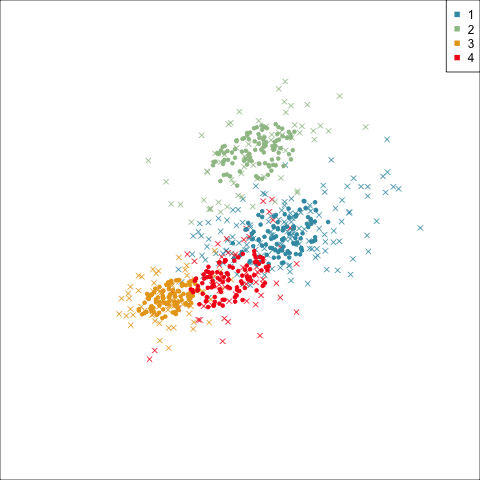
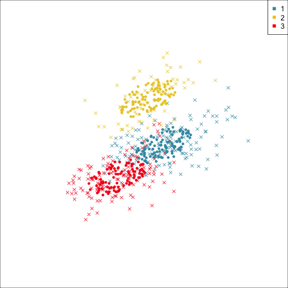
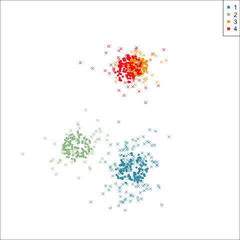
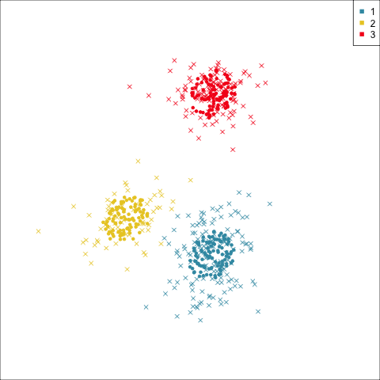

# Model-based clustering {#sec-mclust}

\index{cluster analysis!model-based} 

Model-based clustering [@FR02;@mclust2023] fits a multivariate normal mixture model to the data. It uses the EM algorithm to fit the parameters for the mean, variance-covariance of each population, and the mixing proportion. The variance-covariance matrix is re-parameterised using an eigen-decomposition

$$
\Sigma_k = \lambda_kD_kA_kD_k^\top, ~~~k=1, \dots, g ~~\mbox{(number of clusters)}
$$

\noindent resulting in several model choices, ranging from simple to complex, as shown in `r ifelse(knitr::is_html_output(), '@tbl-covariances-html', '@tbl-covariances-pdf')`.

```{r echo=knitr::is_html_output()}
#| label: mc-libraries
#| message: FALSE
#| code-summary: "Load libraries"
library(dplyr)
library(kableExtra)
library(ggplot2)
library(mclust)
library(mulgar)
library(patchwork)
library(colorspace)
library(tourr)
```

::: {.content-visible when-format="html"}

```{r eval=knitr::is_html_output()}
#| label: tbl-covariances-html
#| tbl-cap: "Parameterizations of the covariance matrix."
#| echo: FALSE
#| message: FALSE
readr::read_csv('misc/mclust-covariances-html.csv') |>
  knitr::kable(align = c('c', 'c', 'c', 'c', 'c', 'c')) |>
  kableExtra::kable_styling(full_width = FALSE)
```
:::

::: {.content-visible when-format="pdf"}
```{r eval=knitr::is_latex_output()}
#| label: tbl-covariances-pdf
#| tbl-cap: "Parameterizations of the covariance matrix."
#| echo: FALSE
#| message: FALSE
readr::read_csv('misc/mclust-covariances-latex.csv') |>
  knitr::kable(align = c('c', 'c', 'c', 'c', 'c', 'c'), 
               format="latex", booktabs = T, 
               escape = FALSE) |>
  kableExtra::kable_styling(full_width = FALSE)
```
:::

\noindent Note the distribution descriptions "spherical" and "ellipsoidal". These are descriptions of the shape of the variance-covariance for a multivariate normal distribution. A standard multivariate normal distribution has a variance-covariance matrix with zeros in the off-diagonal elements, which corresponds to spherically shaped data. When the variances (diagonals) are different or the variables are correlated, then the shape of data from a multivariate normal is ellipsoidal.

\index{Bayes Information Criterion (BIC)}

The models are typically scored using the Bayes Information Criterion (BIC), which is based on the log likelihood, number of variables, and number of mixture components. They should also be assessed using graphical methods, as we demonstrate using the penguins data. 

## Examining the model in 2D

We start with two of the four real-valued variables (`bl`, `fl`) and the three `species`. The goal is to determine whether model-based methods can discover clusters that closely correspond to the three species. Based on the scatterplot in @fig-penguins-bl-fl we would expect it to do well, and suggest an elliptical variance-covariance of roughly equal sizes as the model.

```{r echo=knitr::is_html_output()}
#| label: fig-penguins-bl-fl
#| fig-cap: "Scatterplot of flipper length by bill length of the penguins data, overlaid with density contours. Examining 2D data using a 2D density plot can help assess whether the elliptical variance-covariance model is appropriate for the data. In this case it looks reasonable."
#| fig-alt: "The x axis is labelled bl and has tick marks at -2, -1, 0, 1, 2, 3, and the y axis is labelled fl with tick marks at -2, -1, 0, 1, 2. Black points and blue-green contour lines suggest three modes, one at bottom left, one at top right and one to the middle right. Contours are a little elliptical, except the third mode is only weakly formed."
#| fig-width: 5
#| fig-height: 5
#| out-width: 60%
#| code-summary: "Code to make plot"
load("data/penguins_sub.rda")
ggplot(penguins_sub, aes(x=bl, 
                         y=fl)) + #, 
                         #colour=species)) +
  geom_point() +
  geom_density2d(colour="#3B99B1") +
  theme_minimal() +
  theme(aspect.ratio = 1)
```

To draw ellipses in any dimension, a reasonable procedure is to sample points uniformly on a sphere, and then transform this into a sphere using the inverse of the variance-covariance matrix. The `mulgar` function `mc_ellipse()` does this for each cluster in the fitted model.
\index{data!penguins}

\index{software!mclust}
\index{variance-covariance!ellipse}

```{r}
#| label: fig-penguins-bl-fl-mc
#| message: FALSE
#| code-fold: false
#| fig-width: 8
#| fig-height: 4
#| out-width: 100%
#| fig-cap: "Summary plots from model-based clustering: (a) BIC values for clusters 2-9 of top four models, (b) variance-covariance ellipses and cluster means (+) corresponding to the best model. The best model is three-cluster EVE, which has differently shaped variance-covariances albeit the same volume and orientation."
#| fig-alt: "Two plots side by side. The left plot is a line plot, with x axis labelled Number of clusters and ticks at 2, 3, 4, 5, 6, 7, 8, 9, and y axis labelled BIC_vals and tick marks at -1650 and -1600. There are four coloured lines with different line types labelled EEE, EVE, EVV and VVE by the legend at top right. All peak at x=3 and decline rapidly at higher values. The highest point corresponds to EVE. The plot on the right has the same axes as the previous figure, but three colour groups with no legend. There are two main types of points with the darker ones forming three ellipses overlaying the scatter cloud, centred in each colour group. There is a plus in the middle of each ellipse shape."
# Fit the model, plot BIC, construct and plot ellipses
penguins_BIC <- mclustBIC(penguins_sub[,c(1,3)])
ggmc <- ggmcbic(penguins_BIC, cl=2:9, top=4) + 
  scale_color_discrete_divergingx(palette = "Roma") +
  ggtitle("(a)") +
  theme_minimal() 
penguins_mc <- Mclust(penguins_sub[,c(1,3)], 
                      G=3, 
                      modelNames = "EVE")
penguins_mce <- mc_ellipse(penguins_mc)
penguins_cl <- penguins_sub[,c(1,3)]
penguins_cl$cl <- factor(penguins_mc$classification)
ggell <- ggplot() +
   geom_point(data=penguins_cl, aes(x=bl, y=fl,
                                    colour=cl),
              alpha=0.3) +
   geom_point(data=penguins_mce$ell, aes(x=bl, y=fl,
                                         colour=cl),
              shape=16) +
   geom_point(data=penguins_mce$mn, aes(x=bl, y=fl,
                                        colour=cl),
              shape=3, size=2) +
  scale_color_discrete_divergingx(palette = "Zissou 1")  +
  theme_minimal() +
  theme(aspect.ratio=1, legend.position="none") +
  ggtitle("(b)")
ggmc + ggell + plot_layout(ncol=2)
```

@fig-penguins-bl-fl-mc summarises the results. All models agree that three clusters is the best. The different variance-covariance models for three clusters have similar BIC values with EVE (different shape, same volume and orientation) being slightly higher. These plots are made from the `mclust` package [@R-mclust] output using the `ggmcbic()` and `mc_ellipse()` functions from the `mulgar` package.

## Examining the model in high dimensions

Now we will examine how model-based clustering will group the penguins data using all four variables. @fig-penguins-bic shows the summary of different models, of which we would choose the four-cluster VEE, if we strictly followed the BIC choice. `r ifelse(knitr::is_html_output(), '@fig-penguins-mc-html', '@fig-penguins-mc-pdf')` shows this model in a tour, and the best three-cluster model. You can see that the four-cluster result is inadequate, in various ways. One of the species (Chinstrap) does have a bimodal density, due to the two sexes, and we would expect that a four cluster solution might detect this. However, the four cluster solution doesn't. Instead, it splits the large group of Gentoo into two clusters. This does happen to roughly match the two sexes. We suspect that this is accidental though, and the real reason for splitting this cluster is more analogous to how $k$-means or Wards linkage hierarchical clustering, that a lower within-cluster variance is obtained by splitting a large elliptical cluster into two more spherical clusters. If we expected the clustering solution to include the sexes, we would expect that the best BIC would be 6 clusters, and the three species clusters would be divided into two roughly matching the two sexes in each species. Rather the four cluster solution is one that simply divides the biggest cluster into two, and doesn't truly capture the shape of the data. The tour shows that the three-cluster solution with EEE parametrisation is the best match to the data shape. It fits the three clusters that we can visually see and no more. Thus this is the parsimonious model, the simplest model that adequately captures the data distribution.
\index{data!penguins}

```{r}
#| label: fig-penguins-bic
#| code-fold: false
#| fig-cap: "BIC values for the top models for 2-9 clusters on the penguins data. The interpretation is mixed: if one were to choose three clusters any of the variance-covariance models would be equally as good, but the very best model is the four-cluster VEE."
#| fig-alt: "This is a line plot, with x axis labelled Number of clusters and ticks at 2, 3, 4, 5, 6, 7, 8, 9, and y axis labelled BIC_vals and tick marks at -2600, -2550, -2500 and -2450. There are four coloured lines with different line types labelled EEE (solid brown), EVE (small yellow dashes), VEE (medium light blue dashes) and VVE (large dark blue dashes) by the legend at right. The peak is at x=4 and corresponds to VEE. This curve has high values at x=3 and 5 also. Most lines peak at x=3, with the EEE staying fairly flat up to x=9, and the other two declining."
#| fig-width: 6
#| fig-height: 4
#| fig-align: "center"
penguins_BIC <- mclustBIC(penguins_sub[,1:4])
ggmc <- ggmcbic(penguins_BIC, cl=2:9, top=7) + 
  scale_color_discrete_divergingx(palette = "Roma") +
  theme_minimal() 
ggmc
```

```{r}
#| label: best-mclust
#| code-fold: false
penguins_mc <- Mclust(penguins_sub[,1:4], 
                      G=4, 
                      modelNames = "VEE")
penguins_mce <- mc_ellipse(penguins_mc)
penguins_cl <- penguins_sub
penguins_cl$cl <- factor(penguins_mc$classification)

penguins_mc_data <- penguins_cl |>
  select(bl:bm, cl) |>
  mutate(type = "data") |>
  bind_rows(bind_cols(penguins_mce$ell,
                      type=rep("ellipse",
                               nrow(penguins_mce$ell)))) |>
  mutate(type = factor(type))
```

```{r echo=knitr::is_html_output()}
#| eval: FALSE
#| label: simpler-mclust
#| code-summary: "Code to make animated gifs"
animate_xy(penguins_mc_data[,1:4],
           col=penguins_mc_data$cl,
           pch=c(4, 20 )[as.numeric(penguins_mc_data$type)], 
           axes="off")

load("data/penguins_tour_path.rda")
render_gif(penguins_mc_data[,1:4], 
           planned_tour(pt1), 
           display_xy(col=penguins_mc_data$cl,
               pch=c(4, 20)[
                 as.numeric(penguins_mc_data$type)], 
                      axes="off",
               half_range = 0.7),
           gif_file="gifs/penguins_best_mc.gif",
           frames=500,
           loop=FALSE)

penguins_mc <- Mclust(penguins_sub[,1:4], 
                      G=3, 
                      modelNames = "EEE")
penguins_mce <- mc_ellipse(penguins_mc)
penguins_cl <- penguins_sub
penguins_cl$cl <- factor(penguins_mc$classification)

penguins_mc_data <- penguins_cl |>
  select(bl:bm, cl) |>
  mutate(type = "data") |>
  bind_rows(bind_cols(penguins_mce$ell,
                      type=rep("ellipse",
                               nrow(penguins_mce$ell)))) |>
  mutate(type = factor(type))

animate_xy(penguins_mc_data[,1:4],
           col=penguins_mc_data$cl,
           pch=c(4, 20)[as.numeric(penguins_mc_data$type)], 
           axes="off")

# Save the animated gif
load("data/penguins_tour_path.rda")
render_gif(penguins_mc_data[,1:4], 
           planned_tour(pt1), 
           display_xy(col=penguins_mc_data$cl,
               pch=c(4, 20)[
                 as.numeric(penguins_mc_data$type)], 
                      axes="off",
               half_range = 0.7),
           gif_file="gifs/penguins_simpler_mc.gif",
           frames=500,
           loop=FALSE)
```

::: {.content-visible when-format="html"}
::: {#fig-penguins-mc-html layout-ncol=2}

{#fig-penguins-best_mc fig-alt="Animation showing 2D projections from 4D. There are four colour groups and two types of points, x's and solid circles. The solid circles form elliptical shapes and the x's are more scattered. The four groups are paired into two's that are close together. There is a legend at top right marking blue as 1, light blue-green as 2, yellow as 3 and red as 4. There is no axis display, so the exact projection of the four variables cannot be determined. We can see that one cluster of points that was separated from two other clusters has been divided into two groups, probably unnecessarily." fig.align="center"}

{#fig-penguins-simpler_mc fig-alt="Another animation showing 2D projections from 4D, with only three coloured groups. The two types of points show the elliptical shapes fitting the data more snugly in all projections." fig.align="center"}

Examining the model-based clustering results for the penguins data: (a) best model according to BIC value, (b) simpler three-cluster model. Dots are ellipse points, and "x" are data points. It is important to note that the three cluster solution fits the data better, even though it has a lower BIC. 
:::
:::

::: {.content-visible when-format="pdf"}
::: {#fig-penguins-mc-pdf layout-ncol=2}

{#fig-penguins-best-mc fig-alt="A 2D projection from 4D, showing three separated clusters, coloured with four colours. There are two types of points, x's and solid circles. The solid circles form circular shapes and the x's are more scattered. There is a legend at top right marking blue as 1, light blue-green as 2, yellow as 3 and red as 4. The red group is completely overplotted with the yellow group.  There is no axis display, so the exact projection of the four variables cannot be determined." fig.align="center"}

{#fig-penguins-simpler-mc fig-alt="A 2D projection from 4D, showing three separated clusters, coloured with three colours. There are two types of points, x's and solid circles. The solid circles form circular shapes and the x's are more scattered. There is a legend at top right marking blue as 1, yellow as 2 and red as 3. These colour groups match the three clusters very closely, and the solid circles match the x's very closely, although are more concentrated. There is no axis display, so the exact projection of the four variables cannot be determined." fig.align="center"}

Examining the model-based clustering results for the penguins data: (a) best model according to BIC value, (b) simpler three-cluster model. Dots are ellipse points, and "x" are data points. It is important to note that the three cluster solution fits the data better, even though it has a lower BIC. 
:::
:::

::: {.content-visible when-format="html"}
::: info
Using the tour to visualise the final choices of models with similarly high BIC values helps to choose which best fits the data. It may not be the one with the highest BIC value. 
:::
:::

::: {.content-visible when-format="pdf"}
\infobox{Using the tour to visualise the final choices of models with similarly high BIC values helps to choose which best fits the data. It may not be the one with the highest BIC value.}
:::

```{r}
#| eval: FALSE
#| echo: FALSE
# Its surprising that the four cluster solution didn't 
# pick up the sexes of the Chinstraps, where there is 
# some bimodality. Instead it splits the well-separated 
# group into two! Something to raise in the recap chapter.
penguins_cl |> 
  count(species, cl) |>
  pivot_wider(names_from=cl, 
              values_from=n, 
              values_fill=0)
```

\index{data!clusters}
\index{data!multicluster}
\index{data!fake trees}
\index{data!aflw}

## Exercises {-}

1. Examine the three cluster EVE, VVE and VEE models with the tour, and explain whether these are distinguishably different from the EEE three cluster model.
2. Fit model-based clustering to the `clusters` data. Does it suggest the data has three clusters? Using the tour examine the best model model. How well does this fit the data?
3. Fit model-based clustering to the the `multicluster`. Does it suggest the data has six clusters? Using the tour examine the best model model. How well does this fit the data?
4. Fit model-based clustering to the `fake_trees` data. Does it suggest that the data has 10 clusters? If not, why do you think this is?  Using the tour examine the best model model. How well does this fit the branching structure?
5. Try fitting model-based clustering to the `aflw` data? What is the best model? Is the solution related to offensive vs defensive vs mid-fielder skills?
6. Use model-based clustering on the challenge data sets, `c1`-`c7` from the `mulgar` package. Explain why the best model fits the cluster structure or not.
