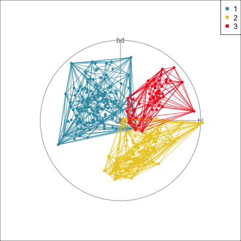
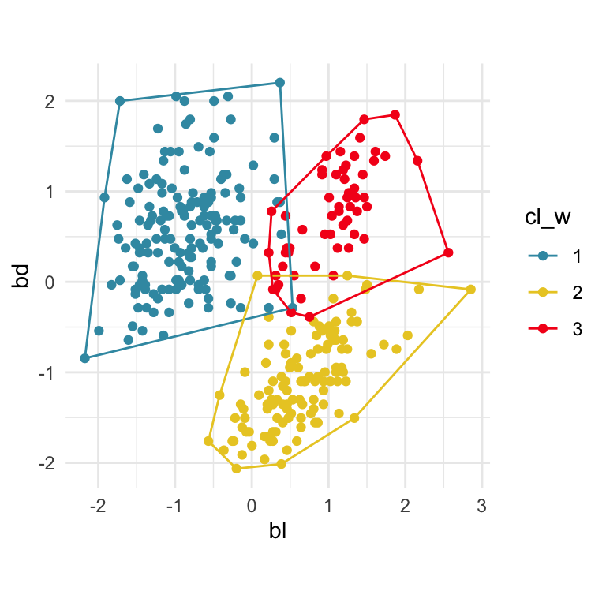
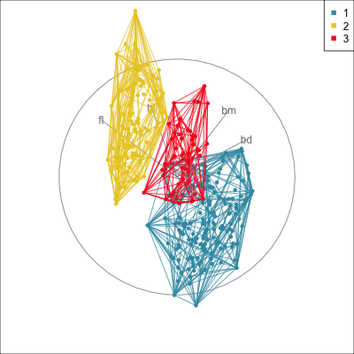
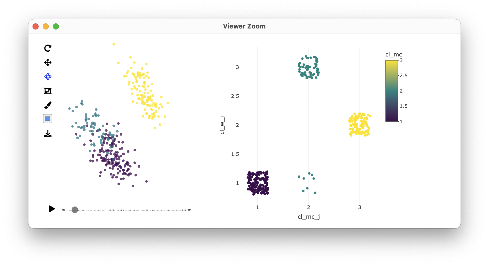
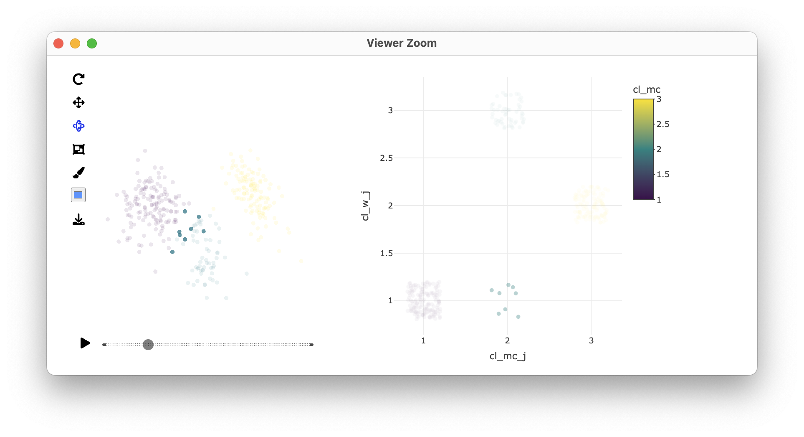
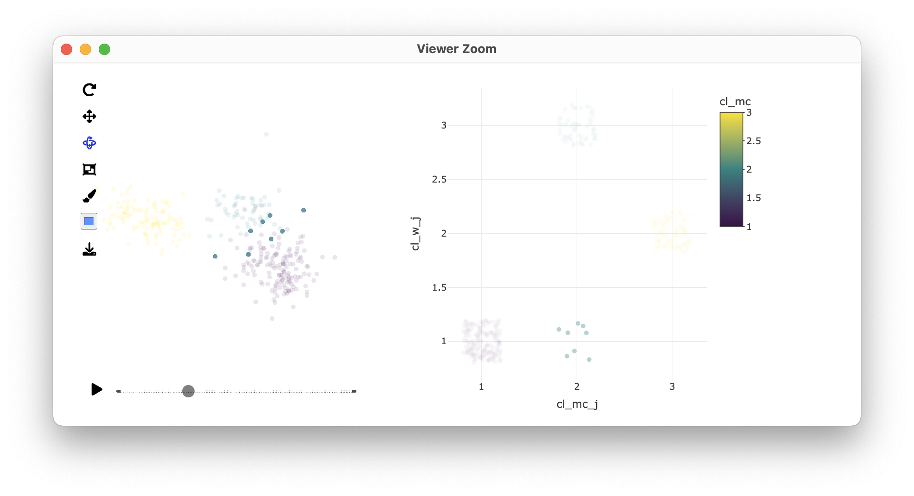

# Summarising and comparing clustering results {#sec-clust-compare}

## Summarising results

It can be considered that the result of a cluster analysis is a smaller data set that describes the original data set more compactly, corresponding to the cluster centres. With this in mind, the key elements for summarising a cluster analysis are, for each cluster:

1. the number of observations
2. a measure of the centre
3. some measure of the variability of observations around each centre.
\index{cluster analysis!summary statistics}

With numerical data, which we have focused on here, the measure of centre is typically the multivariate mean. Measuring the variability can be more complicated. The exception is model-based clustering because it imposes an elliptical variance-covariance structure leaving the variance-covariance estimates for each cluster as suitable measures of 3. The methods discussed in @sec-mclust for displaying the corresponding ellipses in high dimensions is suitable. 
\index{variance-covariance!ellipse}

For all other methods, the shape of the variance is not controlled, so cluster shapes can vary. Some methods have a tendency to create particular shapes, for example $k$-means and Wards linkage hierarchical clustering may result in spherically shapes. But more than likely this is not the case, the algorithm uses a ball to group observations but the shape of the cluster might be very different. Summarising the variability, though is very important, because it provides feedback on the strength of the clustering. A good clustering result makes the large data simpler, where a smaller set of points is an adequate summary of the data.

Generally, to accommodate summarising odd-shaped clusters, it is common to generate the convex hull of each cluster, as shown in `r ifelse(knitr::is_html_output(), '@fig-penguins-chull-html', '@fig-penguins-chull-pdf')`. This can also be done in high-dimensions, using the R package `cxhull` [@R-cxhull] to compute the $p$-D convex hull.

\index{cluster analysis!convex hull}

::: {.content-visible when-format="html"}
::: info
For model-based clustering, the variability within clusters can be summarised by $p$-dimensional ellipses. Generally, a $p$-dimensional convex hull can show the variability within clusters, without assuming a specific distribution.
:::
:::

::: {.content-visible when-format="pdf"}
\infobox{For model-based clustering, the variability within clusters can be summarised by $p$-dimensional ellipses. Generally, a $p$-dimensional convex hull can show the variability within clusters, without assuming a specific distribution.}
:::

```{r echo=knitr::is_html_output()}
#| message: false
#| code-summary: "Load libraries"
library(mclust) 
library(tidyr)
library(dplyr)
library(gt)
library(mulgar)
library(ggplot2)
library(colorspace)
```

```{r echo=knitr::is_html_output()}
#| message: false
#| code-summary: "Code to do clustering"
load("data/penguins_sub.rda")
p_dist <- dist(penguins_sub[,1:2])
p_hcw <- hclust(p_dist, method="ward.D2")
p_cl <- data.frame(cl_w = cutree(p_hcw, 3))
```

\index{data!penguins}

```{r echo=knitr::is_html_output()}
#| code-summary: "Code for convex hulls in 2D"
psub <- penguins_sub |>
  select(bl, bd) |>
  mutate(cl = p_cl$cl_w)

phull <- gen_chull(psub[,1:2], psub$cl)
phull_segs <- data.frame(x = phull$data$bl[phull$edges[,1]],
                         y = phull$data$bd[phull$edges[,1]],
                         xend = phull$data$bl[phull$edges[,2]],
                         yend = phull$data$bd[phull$edges[,2]],
                         cl = phull$edge_clr)
p_chull2D <- ggplot() +
  geom_point(data=phull$data, aes(x=bl, y=bd, 
                            colour=cl)) + 
  geom_segment(data=phull_segs, aes(x=x, xend=xend,
                                    y=y, yend=yend,
                                    colour=cl)) +
  scale_colour_discrete_divergingx(palette = "Zissou 1") +
  theme_minimal() +
  theme(aspect.ratio = 1)
```

```{r echo=knitr::is_html_output()}
#| message: false
#| code-summary: "Code to do clustering"
p_dist <- dist(penguins_sub[,1:4])
p_hcw <- hclust(p_dist, method="ward.D2")

p_cl <- data.frame(cl_w = cutree(p_hcw, 3))

penguins_mc <- Mclust(penguins_sub[,1:4], 
                      G=3, 
                      modelNames = "EEE")
p_cl <- p_cl |> 
  mutate(cl_mc = penguins_mc$classification)
```

```{r}
#| code-summary: "Code to generate pD convex hull"
phull <- gen_chull(penguins_sub[,1:4], p_cl$cl_w)
```

```{r echo=knitr::is_html_output()}
#| eval: false
#| code-summary: "Code to generate pD convex hull and view in tour"
animate_xy(phull$data[,1:4], 
           col=phull$data$cl,
           edges=phull$edges, 
           edges.col=phull$edge_clr)
render_gif(phull$data[,1:4], 
           tour_path = grand_tour(),
           display = display_xy(col=phull$data$cl,
                                edges=phull$edges,
                                edges.col=phull$edge_clr),
           gif_file = "gifs/penguins_chull.gif",
           frames = 500, 
           width = 400,
           height = 400)
```

```{r}
#| eval: false
#| echo: false

# This code is checking that convex hull works
library(geozoo)

cb <- cube.solid.random(p=4, n=1000)$points
phull <- cxhull(cb)$edges

animate_xy(cb, edges=phull)

smp <- simplex(p=4)$points
smp_phull <- cxhull(smp)$edges
animate_xy(smp, edges=smp_phull)

sph <- rbind(sphere.solid.random(p=3)$points,
             sphere.hollow(p=3)$points)
sph_phull <- cxhull(sph)$edges
animate_xy(as.data.frame(sph), edges=sph_phull)
```


::: {.content-visible when-format="html"}

::: {#fig-penguins-chull-html layout-ncol=2}

```{r}
#| label: fig-penguin-hull-2D-html
#| echo: false
#| fig-width: 4
#| fig-height: 4
#| fig-cap: "2D"
#| fig-alt: "Scatterplot with x axis labelled 'bl' and grid lines at -2, -1, 0, 1, 2, 3, and y axis labelled 'bd' and grid lines at -2, -1, 0, 1, 2. Points are coloured blue, yellow and red matching clusters 1, 2, 3, as indicated by the legend at top right. Lines connect points marking the convex hull of each cluster. Blue group is slightly rectangular at top left. Yellow group is wedge-shaped at bottom right, and red group is like a rounded square at top right. All convex hulls overlap in the middle of the plot."
p_chull2D 
```

{#fig-penguins-chull-pD fig-alt="Animation of 2D projections from a tour, showing lines connecting points to show the convex hull in four dimensions for the three clusters. The lines look dense, but do capture the extent of the points in every projection shown. The three clusters 1, 2, 3 are coloured blue, yellow and red, as indicated by the legend at top right. The yellow group's convex hull is separated from the other two, but the red and blue overlap a little."}
:::

Convex hulls summarising the extent of Wards linkage clustering in 2D and 4D.
:::

::: {.content-visible when-format="pdf"}

::: {#fig-penguins-chull-pdf layout-ncol=2}


{#fig-penguins-chull-2D-pdf fig-alt="Scatterplot with x axis labelled 'bl' and grid lines at -2, -1, 0, 1, 2, 3, and y axis labelled 'bd' and grid lines at -2, -1, 0, 1, 2. Points are coloured blue, yellow and red matching clusters 1, 2, 3, as indicated by the legend at top right. Lines connect points marking the convex hull of each cluster. Blue group is slightly rectangular at top left. Yellow group is wedge-shaped at bottom right, and red group is like a rounded square at top right. All convex hulls overlap in the middle of the plot."}

{#fig-penguins-chull-pD fig-alt="A single 2D projection from a tour, showing lines connecting points to show the convex hull in four dimensions for the three clusters. The lines look dense, but do capture the extent of the points in every projection shown. The three clusters 1, 2, 3 are coloured blue, yellow and red, as indicated by the legend at top right. In this projection all three convex hulls overlap."}

Convex hulls summarising the extent of Wards linkage clustering in 2D and 4D. 
:::
:::

## Comparing two clusterings {#sec-compare-clusterings}
\index{cluster analysis!confusion table}

Each cluster analysis will result in a vector of class labels for the data. To compare two results we would tabulate and plot the pair of integer variables. The labels given to each cluster will likely differ. If the two methods agree, there will be just a few cells with large counts among mostly empty cells. 

Below is a comparison between the three cluster results of Wards linkage hierarchical clustering (rows) and model-based clustering (columns). The two methods mostly agree, as seen from the three cells with large counts, and most cells with zeros. They disagree only on eight penguins. These eight penguins would be considered to be part of cluster 1 by Wards, but model-based considers them to be members of cluster 2.

The two methods label the clusters differently: what Wards labels as cluster 3, model-based labels as cluster 2. The labels given by any algorithm are arbitrary, and can easily be changed to coordinate between methods. 

```{r echo=knitr::is_html_output()}
#| code-summary: "Code to make confusion table"
p_cl |> 
  count(cl_w, cl_mc) |> 
  pivot_wider(names_from = cl_mc, 
              values_from = n, 
              values_fill = 0) |>
  gt() |>
  tab_spanner(label = "cl_mc", columns=c(`2`, `3`, `1`)) |>
  cols_width(everything() ~ px(60))
```

We can examine the disagreement by linking a plot of the table, with a tour plot. Linking the confusion matrix with the tour can be accomplished with `crosstalk` and `detourr`. @fig-compare-clusters show screenshots of the exploration of the eight penguins on which the methods disagree. It makes sense that there is some confusion. These penguins are part of the large clump of observations that don't separate cleanly into two clusters. The eight penguins are roughly in the middle of this clump, and there is no clear place to split this large clump. Realistically, both methods result in a plausible clustering.  

```{r}
#| eval: false
#| message: false
#| echo: false
#| code-summary: "Code to do linked brushing with liminal"
library(liminal)
penguins_cl <- bind_cols(penguins_sub, p_cl)
p_cl <- p_cl |>
  mutate(cl_w_j = jitter(cl_w),
         cl_mc_j = jitter(cl_mc))
limn_tour_link(
  p_cl[,3:4],
  penguins_cl,
  cols = bl:bm,
  color = cl_w
)
```

::: {#fig-compare-clusters fig-align="center" layout-ncol=1}

{fig-alt="Screenshot showing scatterplot on the left and jittered dotplot of the confusion table at right. Points are coloured using the viridis palette running from yellow to green to deep purple. The scatterplot of the confusion matrix shows groups of points at (1,1), (2,1), (3,2) and (2,3). The group at (2,1) is small, and are the points where the two clusterings disagree." width=400}

{fig-alt="Screenshot showing scatterplot on the left and jittered dotplot of the confusion table at right. The points at (2,1) in the confusion table are highlighted and all others very faint. These can be seen in the scatterplot at left to be in the middle of the overlap between the green and purple clusters, 1 and 2." width=400}

{fig-alt="Screenshot showing scatterplot of a different 2D projection on the left and jittered dotplot of the confusion table at right. The points at (2,1) in the confusion table are highlighted and all others very faint. Again, these can be seen in the scatterplot at left to be in the middle of the overlap between the green and purple clusters, 1 and 2." width=400}

Comparing the model-based and Wards hierarchical linkage solutions using linking between the confusion table and a tour, using detourr. Points are coloured according to the model-based result. The disagreement on eight penguins is with cluster 1 from Wards and cluster 2 from model-based. These penguins fall in the middle of the large clump of points, where it is not possible to cleanly decide on a split. Both solutions are plausible.
:::


\index{software!crosstalk}
\index{software!detourr}

```{r}
#| eval: false
#| echo: true
#| code-summary: "Code to do interactive graphics"
library(crosstalk)
library(plotly)
library(detourr)
library(viridis)
p_cl <- p_cl |> 
  mutate(cl_w_j = jitter(cl_w),
         cl_mc_j = jitter(cl_mc))
penguins_cl <- bind_cols(penguins_sub, p_cl)
p_cl_shared <- SharedData$new(penguins_cl)

set.seed(1046)
detour_plot <- detour(p_cl_shared, tour_aes(
  projection = bl:bm,
  colour = cl_mc)) |>
    tour_path(grand_tour(2), 
                    max_bases=100, fps = 60) |>
       show_scatter(alpha = 0.7, axes = FALSE,
                    width = "100%", height = "450px")

conf_mat <- plot_ly(p_cl_shared, 
                    x = ~cl_mc_j,
                    y = ~cl_w_j,
                    color = ~cl_mc,
                    colors = viridis_pal(option = "D")(3),
                    height = 450) |>
  highlight(on = "plotly_selected", 
              off = "plotly_doubleclick") |>
    add_trace(type = "scatter", 
              mode = "markers")
  
bscols(
     detour_plot, conf_mat,
     widths = c(5, 6)
 )                 
```


::: {.content-visible when-format="html"}
::: info
Linking a scatterplot showing the confusion matrix and a tour plot can help to decide whether one solution is better than another, or not.
:::
:::

::: {.content-visible when-format="pdf"}
\infobox{Linking a scatterplot showing the confusion matrix and a tour plot can help to decide whether one solution is better than another, or not.
}
:::


\index{data!fake trees}
\index{data!aflw}
\index{data!c1-c7}

## Exercises {-}

1. Compare the results of the four cluster model-based clustering with that of the four cluster Wards linkage clustering of the penguins data.
2. Compare the results from clustering of the `fake_trees` data for two different choices of $k$. (This follows from the exercise in @sec-kmeans.) Which choice of $k$ is best? And what choice of $k$ best captures the 10 known branches?
3. Compare and contrast the cluster solutions for the first four PCs of the `aflw` data, conducted in @sec-hclust and @sec-kmeans. Which provides the most useful clustering of this data?
4. Compute the convex hulls for the final clustering of the `aflw` data. What do you learn about the shapes of the final clusters, and which variables most contribute to the difference between clusters.
5. Pick your two clusterings on one of the challenge data sets, `c1`-`c7` from the `mulgar` package, that give very different results. Compare and contrast the two solutions, and decide which is the better solution.
6. Use model-based clustering on the `c1` data, as done in Q6 @sec-mclust. Construct the summary of the best 6 cluster solution, that uses ellipses to summarise each cluster. How good is this fit?
7. Use Wards linkage linkage clustering for the `c4` data set. Choose 5 clusters as the result. Construct the convex hulls for the solution and display with a grand tour.

```{r}
#| eval: false
#| echo: false
library(mulgar)
library(tourr)
animate_xy(c4[,c(1:4, 6)])
c4_hc <- hclust(dist(c4[,c(1:4, 6)]), method="ward.D2")
plot(c4_hc)
cl <- cutree(c4_hc, 5)
c4_cl <- c4 |>
  select(x1:x4, x6) |>
  mutate(cl = factor(cl))
animate_xy(c4_cl[,1:5], col=c4_cl$cl)
c5_chull <- gen_chull(c4_cl[,1:5], as.numeric(c4_cl$cl))
animate_xy(c5_chull$data[,1:5], 
           col=c5_chull$data$cl,
           edges=c5_chull$edges, 
           edges.col=c5_chull$edge_clr)

```

\index{data!risk}

## Project {-}

Most of the time your data will not neatly separate into clusters, but partitioning it into groups of similar observations can still be useful. In this case our toolbox will be useful in comparing and contrasting different methods, understanding to what extend a cluster mean can describe the observations in the cluster, and also how the boundaries between clusters have been drawn. To explore this we will use survey data that examines the risk taking behavior of tourists, this is the `risk_MSA` data, see the Appendix for details.

1. We first examine the data in a grand tour. Do you notice that each variable was measured on a discrete scale?
2. Next we explore different solutions from hierarchical clustering of the data. For comparison we will keep the number of clusters fixed to 6 and we will perform the hierarchical clustering with different combinations of distance functions (Manhattan distance and Euclidean distance) and linkage (single, complete and Ward linkage). Which combinations make sense based on what we know about the method and the data?
3. For each of the hierarchical clustering solutions draw the dendrogram in 2D and also in the data space. You can also map the grouping into 6 clusters to different colors. How would you describe the different solutions?
4. Using the method introduced in this chapter, compare the solution using Manhattan distance and complete linkage to one using Euclidean distance and Ward linkage. First compute a confusion table and then use `liminal` or `detourr` to explore some of the differences. For example, you should be able to see how small subsets where the two clustering solutions disagree can be outlying and are grouped differently depending on the choices we make.
5. Selecting your preferred solution from hierarchical clustering, we will now compare it to what is found using $k$-means clustering with $k=6$. Use a tour to show the cluster means together with the data points (make sure to pick an appropriate symbol for the data points to avoid too much overplotting). What can you say about the variation within the clusters? Can you match some of the clusters with the most relevant variables from following the movement of the cluster means during the tour?
6. Use a projection pursuit guided tour to best separate the clusters identified with $k$-means clustering. How are the clusters related to the different types of risk?\index{tour!guided}
7. Use the approaches from this chapter to summarize and compare the $k$-means solution to your selected hierarchical clustering results. Are the groupings mostly similar?
<!--You can also use convex hulls to better compare what part of the space is occupied. Either look at subsets (selected from the liminal display) or you could facet the display using `tourr::animate_groupxy`. -->
8. Some other possible activities include examining how model-based methods would cluster the data. We expect it should be similar to Wards hierarchical or $k$-means, that it will partition into roughly equal chunks with an EII variance-covariance model being optimal. Also examining an SOM fit. SOM is not ideal for this data because the data fills the space. If the SOM model is fitted properly it should be a tangled net where the nodes (cluster means) are fairly evenly spread out. Thus the result should again be similar to Wards hierarchical or $k$-means. A common problem with fitting an SOM is that optimisation stops early, before fully capturing the data set. This is the reasons to use the tour for SOM. If the net is bunched  in one part of the data space, it means that the optimisation wasn't successful.


```{r}
#| eval: false
#| echo: false
#| message: false
#| warning: false
library(tidyverse)
risk <- readRDS("data/risk_MSA.rds")
# looking at the data
library(tourr)
animate_xy(risk)
# hierarchical clustering solutions
risk_h_mc <- hclust(dist(risk, method = "manhattan"),
                  method = "complete")
risk_h_ms <- hclust(dist(risk, method = "manhattan"),
                  method = "single")
risk_h_ew <- hclust(dist(risk, method = "euclidean"),
                  method = "ward.D2")
# adding the clustering information to the data
risk_clw <- risk |> 
  as_tibble() |>
  mutate(cl_h_mc = factor(cutree(risk_h_mc, 6))) |>
  mutate(cl_h_ms = factor(cutree(risk_h_ms, 6))) |>
  mutate(cl_h_ew = factor(cutree(risk_h_ew, 6)))
# drawing 2D dendrograms
library(ggdendro)
ggplot() +
  geom_segment(data=dendro_data(risk_h_mc)$segments, 
               aes(x = x, y = y, 
                   xend = xend, yend = yend)) + 
  theme_dendro()
ggplot() +
  geom_segment(data=dendro_data(risk_h_ms)$segments, 
               aes(x = x, y = y, 
                   xend = xend, yend = yend)) + 
  theme_dendro()
ggplot() +
  geom_segment(data=dendro_data(risk_h_ew)$segments, 
               aes(x = x, y = y, 
                   xend = xend, yend = yend)) + 
  theme_dendro()
# dendrogram in the data space
library(mulgar)
risk_hfly_mc <- hierfly(risk_clw, risk_h_mc, scale=FALSE)
risk_hfly_ms <- hierfly(risk_clw, risk_h_ms, scale=FALSE)
risk_hfly_ew <- hierfly(risk_clw, risk_h_ew, scale=FALSE)
glyphs <- c(16, 46)
pchw_mc <- glyphs[risk_hfly_mc$data$node+1]
pchw_ms <- glyphs[risk_hfly_ms$data$node+1]
pchw_ew <- glyphs[risk_hfly_ew$data$node+1]
# manhattan + complete
# we can see hierarchical structure, small groups at the
# edges that get connected first and then combined into
# larger cluster, looks like some of the clusters are
# really spread out across the data space
animate_xy(risk_hfly_mc$data[,1:6], 
           col=risk_clw$cl_h_mc, 
           tour_path = grand_tour(),
           pch = pchw_mc,
           edges=risk_hfly_mc$edges, 
           axes="bottomleft",
           rescale=FALSE)
# Manhattan + single
# pretty much all the edges point in towards the center!
animate_xy(risk_hfly_ms$data[,1:6], 
           col=risk_clw$cl_h_ms, 
           tour_path = grand_tour(),
           pch = pchw_ms,
           edges=risk_hfly_ms$edges, 
           axes="bottomleft",
           rescale=FALSE)
# euclidean + ward
# at this stage looks mostly similar to mc case
animate_xy(risk_hfly_ew$data[,1:6], 
           col=risk_clw$cl_h_ew, 
           tour_path = grand_tour(),
           pch = pchw_ew,
           edges=risk_hfly_ew$edges, 
           axes="bottomleft",
           rescale=FALSE)

# comparison of two solutions
# confusion table shows quite some disagreements
risk_clw |> 
  count(cl_h_mc, cl_h_ew) |> 
  pivot_wider(names_from = cl_h_mc, 
              values_from = n, 
              values_fill = 0)
# explore with liminal
liminal::limn_tour_link(
  tibble::as.tibble(cbind(jitter(as.numeric(risk_clw$cl_h_ew)),
                          jitter(as.numeric(risk_clw$cl_h_mc)))),
  risk_clw,
  cols = 1:6,
  color = cl_h_ew)
# for example we can see cluster 2 for mc solution is very large,
# in the ew solution this is split up into 3 larger clusters,
# and in the tour we see how the smaller clusters 5 and 6 are different
# and less compact than the largest cluster 2 for the ew solution

# k-means + tour with cluster means
r_km <- kmeans(risk, centers=6, 
                     iter.max = 500, nstart = 5)
r_km_means <- data.frame(r_km$centers) |>
  mutate(cl = factor(rownames(r_km$centers)))
r_km_d <- as.tibble(risk) |> 
  mutate(cl = factor(r_km$cluster))
r_km_means <- r_km_means |>
  mutate(type = "mean")
r_km_d <- r_km_d |>
  mutate(type = "data")
r_km_all <- bind_rows(r_km_means, r_km_d)
r_km_all$type <- factor(r_km_all$type, levels=c("mean", "data"))
r_pch <- c(3, 46)[as.numeric(r_km_all$type)]
r_cex <- c(3, 1)[as.numeric(r_km_all$type)]
animate_xy(r_km_all[,1:6], col=r_km_all$cl, 
           pch=r_pch, cex=r_cex, axes="bottomleft")

# guided tour + interpretation in terms of variables
set.seed(543)
animate_xy(r_km_all[,1:6],
           tour_path = guided_tour(lda_pp(r_km_all$cl)) ,
           col=r_km_all$cl, 
           pch=r_pch, cex=r_cex, axes="bottomleft")
# from this solution it seems there is an overall
# risk behavior captured in the clustering, i.e. most
# variable contribute to separating the clusters along the
# x direction
# health risks seem to be a bit different, with one cluster
# containing average risk scores apart from high risk 
# scores for the health variable

# comparison k-means vs hierarchical clustering solution with liminal
# we can see that the k-means grouping is very different
liminal::limn_tour_link(
  tibble::as.tibble(cbind(jitter(as.numeric(r_km_d$cl)),
                          jitter(as.numeric(risk_clw$cl_h_mc)))),
  r_km_d,
  cols = 1:6,
  color = cl)

# comparison k-means vs hierarchical clustering solution
# using convex hull in the data space
# need to do one at a time since there is too much going on
# starting with hierarchical clustering solution
library(cxhull)
dup <- duplicated(risk_clw[,1:6])
risk_clw <- risk_clw[!dup,]
risk_clw$cl_h_ew <- as.numeric(risk_clw$cl_h_ew)
ncl_h <- risk_clw |>
  count(cl_h_ew) |>
  arrange(cl_h_ew) |>
  mutate(cumn = cumsum(n))
phull <- NULL
risk_clw <- arrange(risk_clw, cl_h_ew) # this is important since this is
# the sorting assumed when collecting the edges!
for (i in unique(risk_clw$cl_h_ew)) {
  x <- risk_clw |>
    dplyr::filter(cl_h_ew == i) 
  ph <- cxhull(as.matrix(x[,1:6]))$edges
  if (i > 1) {
    ph <- ph + ncl_h$cumn[i-1]
  }
  ph <- cbind(ph, rep(i, nrow(ph)))
  phull <- rbind(phull, ph)
}
phull <- as.data.frame(phull)
colnames(phull) <- c("from", "to", "cl_h_ew") 
phull$cl_h_ew <- factor(phull$cl_h_ew)
risk_clw$cl_h_ew <- factor(risk_clw$cl_h_ew)
animate_groupxy(risk_clw[,1:6], col=risk_clw$cl_h_ew, pch=".",
           edges=as.matrix(phull[,1:2]), edges.col=phull$cl_h_ew,
           group_by=risk_clw$cl_h_ew)

# repeat for kmeans
dup <- duplicated(r_km_d[,1:6])
r_km_d <- r_km_d[!dup,]
r_km_d$cl <- as.numeric(r_km_d$cl)
ncl_h <- r_km_d |>
  count(cl) |>
  arrange(cl) |>
  mutate(cumn = cumsum(n))
phull <- NULL
r_km_d <- arrange(r_km_d, cl) # this is important since this is
# the sorting assumed when collecting the edges!
for (i in unique(r_km_d$cl)) {
  x <- r_km_d |>
    dplyr::filter(cl == i) 
  ph <- cxhull(as.matrix(x[,1:6]))$edges
  if (i > 1) {
    ph <- ph + ncl_h$cumn[i-1]
  }
  ph <- cbind(ph, rep(i, nrow(ph)))
  phull <- rbind(phull, ph)
}
phull <- as.data.frame(phull)
colnames(phull) <- c("from", "to", "cl") 
phull$cl <- factor(phull$cl)
r_km_d$cl <- factor(r_km_d$cl)
animate_groupxy(r_km_d[,1:6], col=r_km_d$cl, pch=".",
           edges=as.matrix(phull[,1:2]), edges.col=phull$cl,
           group_by=r_km_d$cl)
# comparing the chull makes it easier to see what part of the space is
# occupied by each of the clusters

# SOM
library(kohonen)
library(aweSOM)
set.seed(947)
r_grid <- somgrid(xdim = 5, ydim = 5,
                           topo = 'rectangular')
r_init <- somInit(risk, 5, 5)
r_som <- som(risk, 
             rlen=500,
             grid = r_grid,
             init = r_init)
r_som_df_net <- som_model(r_som)
r_som_map <- r_som_df_net$net |>
  mutate(type="net")
r_som_data <- mutate(as.tibble(risk), type = "data")
r_som_map_data <- bind_rows(r_som_map, r_som_data)
r_som_map_data$type <- factor(r_som_map_data$type,
  levels=c("net", "data"))
animate_xy(r_som_map_data[,1:6],
           edges=as.matrix(r_som_df_net$edges),
           pch = 46,
           edges.col = "black",
           axes="bottomleft")
# We wouldn't expect SOM to work well for this data because it's
# pretty fully spread in the 6D. So the net is fairly tangled 
# filling out the space. Each node is where a cluster mean is
# placed, so you would see the placements of these means are
# fairly well spread - if the model fit optimisation has worked 
# properly. Probably the best use is to check that the model was fit
# well, and the final results should look similar to k-means
# because there is no benefit from having the net structure here.
```


