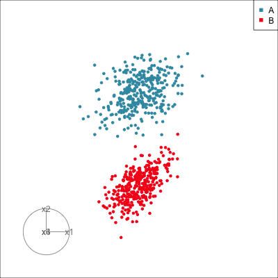
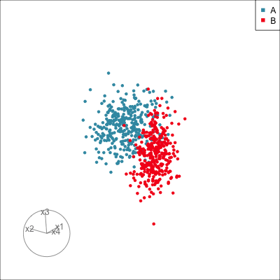
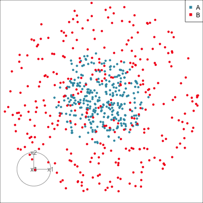
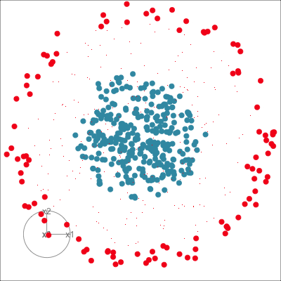
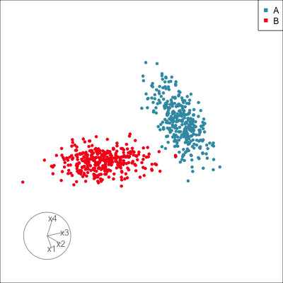
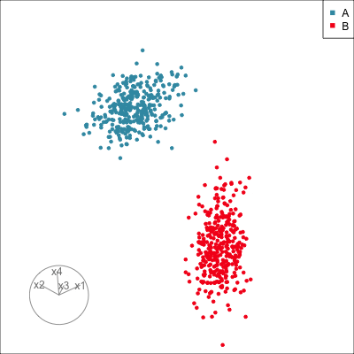
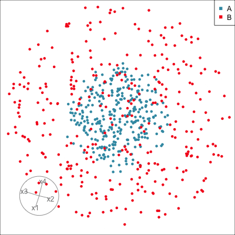
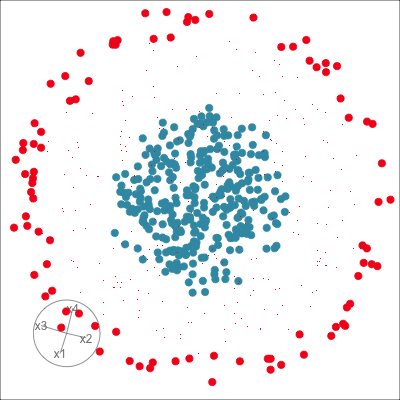

# Introduction to supervised classification {#sec-class-intro}

Methods for supervised classification originated in the early twentieth century, under the term *discriminant analysis* (see, for example, @Fi36). The late 1900s and 2000s has seen an explosion of research with many new methods emerging, especially addressing the increased collection of data, and storage in databases. The fundamental goals and approaches remain the same: to be able to accurately predict the class labels using a model developed from a categorical response variable and multivariate predictors. In contrast to unsupervised classification, the class label (categorical response variable) is known, in the training sample. The training sample is used to build the prediction model, and also to estimate the accuracy, or inversely error, of the model for future data. 

\index{classification!training sample}

::: {.content-visible when-format="html"}
::: info
Start by colouring points by the class variable, and examine whether the colour groups separate into clusters or are different in shape.  
:::
:::

::: {.content-visible when-format="pdf"}
\infobox{Start by colouring points by the class variable, and examine whether the colour groups separate into clusters or are different in shape.}
:::

\index{classification!supervised}
\index{classification!accuracy}

## Beyond predictive accuracy

For a long time the focus has been on methods and algorithms that maximise predictive accuracy. While this is still an ongoing aim, a substantial change has been gaining traction: being able to understand a model, to interpret it, to understand how predictions are made. We may ask questions like:

- Are the classes well separated in the data space, so that they
correspond to distinct clusters?  If so, what are the shapes of the clusters?  Is each cluster sufficiently ellipsoidal so that we can assume that the data arises from a mixture of multivariate normal distributions?  Do the clusters exhibit characteristics that suggest one algorithm in preference to others?
- Where does the boundary between classes fall?  Are the classes
linearly separable, or does the difference between classes suggest
a non-linear boundary?  How do changes in the input parameters affect these boundaries? How do the boundaries generated by different methods vary?
- What cases are misclassified, or have more uncertain predictions?  Are there places in the data space where predictions are especially good or bad?
- Which predictors most contribute to the model predictions? Is it possible to reduce the set of explanatory variables?

```{r echo=knitr::is_html_output()}
#| code-summary: "Load libraries"
source("code/setup.R")
```

```{r}
#| label: fig-sup-example
#| fig-cap: "Examples of supervised classification patterns: (a) linearly separable, (b) linear but not completely separable, (c) non-linearly separable, (d) non-linear, but not completely separable."
#| fig-alt: "A set of four scatter plots labeled (a), (b), (c), and (d), each showing two groups of data points in red and blue. The distribution of points varies across the plots. In (a), the red and blue points are relatively well separated along a diagonal trend. In (b), the separation is less clear, with more overlap between the groups. In (c) and (d), the points follow a zig-zag pattern, separated in (c) but overlapping in (d)."
#| echo: false
#| message: false
#| fig-height: 2.5
#| fig-width: 7.5
#| out-width: 100%
set.seed(524)
x1 <- runif(176) + 0.5
x1[1:61] <- x1[1:61] - 1.2
x2 <- 1 + 2*x1 + rnorm(176)
x2[1:61] <- 2 - 3*x1[1:61] + rnorm(61)
x3 <- runif(176) + 0.5
x3[1:61] <- x3[1:61] - 0.5
x4 <- 0.25 - x3 + rnorm(176)
x4[1:61] <- -0.25 + 3*x3[1:61] + rnorm(61)
cl <- factor(c(rep("A", 61), rep("B", 176-61)))
df <- data.frame(x1, x2, x3, x4, cl)
class1 <- ggplot(df, aes(x=x1, y=x2, colour = cl)) +
  geom_point(alpha=0.7) +
  scale_colour_discrete_divergingx(
      palette = "Zissou 1", nmax = 2, rev = TRUE) +
  annotate("text", -0.65, 6.6, label="a") +
  theme(aspect.ratio=1,
        legend.position = "none",
        axis.text = element_blank(),
        axis.title = element_blank(),
        axis.ticks = element_blank(),
        panel.background = element_rect("white"),
        panel.border = element_rect("black", fill=NA, 
             linewidth = 0.5)) 
class2 <- ggplot(df, aes(x=x3, y=x4, colour = cl)) +
  geom_point(alpha=0.7) +
  scale_colour_discrete_divergingx(
      palette = "Zissou 1", nmax = 2, rev = TRUE) +
  annotate("text", 0.05, 4.1, label="b") +
  theme(aspect.ratio=1,
        legend.position = "none",
        axis.text = element_blank(),
        axis.title = element_blank(),
        axis.ticks = element_blank(),
        panel.background = element_rect("white"),
        panel.border = element_rect("black", fill=NA, 
             linewidth = 0.5))
set.seed(826)
x5 <- 2*(runif(176) - 0.5)
x6 <- case_when(x5 < -0.4 ~ -1.2 - 3 * x5,
                x5 > 0.2 ~ 2.4 - 3 * x5,
                .default = 1.2 + 3 * x5)
x5 <- 2*x5
x6 <- x6 + rnorm(176) * 0.25
x6[1:83] <- x6[1:83] - 1.5
x7 <- 2*(runif(176) - 0.5)
x8 <- case_when(x7 < -0.4 ~ -1.2 - 3 * x7,
                x7 > 0.2 ~ 2.4 - 3 * x7,
                .default = 1.2 + 3 * x7)
x7 <- 2*x7
x8[x7 < -0.1] <- x8[x7 < -0.1] + rnorm(length(x8[x7 < -0.1])) * 0.25
x8[x7 >= -0.1] <- x8[x7 >= -0.1] + rnorm(length(x8[x7 >= -0.1])) * 0.5
x8[1:83] <- x8[1:83] - 1.5
cl2 <- factor(c(rep("A", 83), rep("B", 176-83)))
df2 <- data.frame(x5, x6, x7, x8, cl2)
class3 <- ggplot(df2, aes(x=x5, y=x6, colour = cl2)) +
  geom_point(alpha=0.7) +
  scale_colour_discrete_divergingx(
      palette = "Zissou 1", nmax = 2, rev = TRUE) +
  annotate("text", 1.92, 2.07, label="c") +
  theme(aspect.ratio=1,
        legend.position = "none",
        axis.text = element_blank(),
        axis.title = element_blank(),
        axis.ticks = element_blank(),
        panel.background = element_rect("white"),
        panel.border = element_rect("black", fill=NA, 
             linewidth = 0.5))
class4 <- ggplot(df2, aes(x=x7, y=x8, colour = cl2)) +
  geom_point(alpha=0.7) +
  scale_colour_discrete_divergingx(
      palette = "Zissou 1", nmax = 2, rev = TRUE) +
  annotate("text", 1.95, 1.9, label="d") +
  theme(aspect.ratio=1,
        legend.position = "none",
        axis.text = element_blank(),
        axis.title = element_blank(),
        axis.ticks = element_blank(),
        panel.background = element_rect("white"),
        panel.border = element_rect("black", fill=NA, 
             linewidth = 0.5))
print(class1 + class2 + class3 + class4 + plot_layout(ncol=4))
```

@fig-sup-example shows some 2D examples where the two classes are (a) linearly separable, (b) not completely separable but linearly different, (c) non-linearly separable and (d) not completely separable but with a non-linear difference. We can also see that in (a) only the horizontal variable would be important for the model because the two classes are completely separable in this direction. Although the data in (c) has separable classes, most models would have difficulty capturing the separation. It is for this reason that it is important to understand the boundary between classes produced by a fitted model. In each of b, c, d it is likely that some observations would be misclassified. Identifying these cases, and inspecting where they are in the data space is important for understanding the model's performance on different samples. 

Explainability has been a pursuit in statistics for a long time, and includes checking model assumptions, diagnosing the fit, and assessing variable importance. Interpretability also motivates the emerging field called explainable artificial intelligence (XAI), which is developing methods to determine how a model makes decisions on individual cases. Statistical models tend be easy to describe and interpret because they impose strong assumptions on data, that may or may not be reasonable. In contrast, computational models that follow prescribed algorithms tend to be seen as having fewer assumptions and can flexibly fit to data. However, all algorithms impose some belief that may or may not be reasonable, and this needs checking.


## Balancing bias and variance

Using a machine learning conceptual framework and associated terminology may be helpful in understanding the importance of explainability. Modeling methods are characterised by *bias* and *variance*, and *flexibility*. Imposing more beliefs or assumptions on the model fit potentially creates a more biased (and less flexible) model. Here are some examples of the reasoning: 

- In linear discriminant analysis (LDA) (@sec-lda) there is a strong assumption that classes correspond to elliptical clusters. If the data does *not* have classes with this structure the result is a biased model that does not fit the data. 
- In contrast, tree algorithms (@sec-trees-forests) (most commonly) operate on single variables at each split, which imposes the belief that there is no correlation between variables. If the data *does* have elliptical clusters where separations are in combinations of variables then a tree model will produce a biased model that does not effectively fit the data.
- The tree model is considered more flexible that LDA because the algorithm can be forced to keep iterating to closely fit a particular training sample. 
- The LDA model may have high bias, but it will likely generate a similar fitted model if a different sample of data was used, and thus has low variance. 
- In contrast a tree model could be forced to have low bias for a particular sample of data, if the same algorithm was fitted to a different sample it would likely be quite different, thus be described as high variance. 

\index{classification!linear discriminant analysis (LDA)}
\index{classification!bias}
\index{classification!variance}
\index{classification!flexibility}

::: {.content-visible when-format="html"}
::: info
Using high-dimensional visualisation to understand the shapes of the class clusters will help to assess whether a particular method will likely result in a high or low bias model. 
:::
:::

::: {.content-visible when-format="pdf"}
\infobox{Using high-dimensional visualisation to understand the shapes of the class clusters will help to assess whether a particular method will likely result in a high or low bias model.}
:::


Predictive accuracy trades off these characteristics, with the best model having low bias, low variance. A useful model is sufficiently flexible but no more than necessary. @fig-bias-variance illustrates these model attributes for the data used in @fig-sup-example c. There are three samples (columns) drawn from the same process, that generates the separated zig-zag clusters, and two different types of models are fitted (rows). The training samples are shown as black points, with symbol indicating the class. The colour represents the predictions from the different fitted models. Plots a and d show one training sample; plots b and e show a second training sample; plots c and f show the third training sample. Plots a, b and c show predictions from a simple parametric statistical model, and plots d, e, f show predictions from a computational model that has few assumptions. The model fitted in a-c has high bias because it does not capture the zig-zag but low variance because it is virtually identical for all samples. The second model with fit shown in d-f has lower bias, because it more flexibly fits the zig-zag structure. But it has higher variance, because the actual model changes substantially for different training samples. Balancing this trade-off to achieve a model that has low bias and low variability is desirable. \index{software!MASS}\index{software!rpart}\index{software!classifly}

```{r}
#| label: fig-bias-variance
#| fig-cap: "Illustrating bias and variance using three different samples (black points) from the same distribution (in the columns) and two different model fits (rows). Colour indicates predictions from the resulting fitted model. The model used in a-c does not capture the zig-zag clusters, but is virtually the same regardless of training sample: it has high bias but low variance. The model used in d-f captures the zig-zag reasonably, but the boundary differs substantially between training samples: it has low bias but high variance."
#| fig-alt: "A set of six square plots labeled (a) to (f), arranged in a 2x3 grid. Data points are overlaid as black crosses and circles. Each group follows a zig-zag pattern with crosses at top and separated from circles. The colours, red and blue, display a binary classification boundary, which is linear in (a) to (c) and different step function shapes in (d) to (f). "
#| echo: false
#| message: false
#| fig-height: 4
#| fig-width: 6
#| out-width: 100%
n <- 486
set.seed(826)
x1 <- 2*(runif(n) - 0.5)
x2 <- case_when(x1 < -0.4 ~ -1.2 - 3 * x1,
                x1 > 0.2 ~ 2.4 - 3 * x1,
                .default = 1.2 + 3 * x1)
x1 <- 2*x1
x2 <- x2 + rnorm(n) * 0.25
x2[1:(n/2)] <- x2[1:(n/2)] - 1.5
cl <- factor(c(rep("A", n/2), rep("B", n-n/2)))
df3 <- data.frame(x1, x2, cl)
df_lda <- lda(cl~x1+x2, data=df3)
df_lda_bnd <- explore(df_lda, df3)
bv1 <- ggplot() + 
  geom_point(data=filter(df_lda_bnd, 
                         .TYPE == "simulated"), 
       aes(x=x1, y=x2, colour=cl), alpha=0.6) +
  scale_colour_discrete_divergingx(palette = "Zissou 1") +
  geom_point(data=df3, aes(x=x1, y=x2, shape=cl),
             colour="black", alpha=0.5) +
  scale_shape_manual(values = c(1,4)) +
  annotate("text", 1.8, 1.9, label="a") +
  theme_minimal() +
  theme(aspect.ratio = 1,
        legend.position = "none",
        axis.title = element_blank(),
        axis.text = element_blank())

df_tree <- rpart(cl~x1+x2, data=df3, 
   control = rpart.control(minsplit = 5, cp = 0.00001))
df_tree_bnd <- explore(df_tree, df3)
bv2 <- ggplot() + 
  geom_point(data=filter(df_tree_bnd, .TYPE == "simulated"), 
       aes(x=x1, y=x2, colour=cl), alpha=0.6) +
  scale_colour_discrete_divergingx(palette = "Zissou 1") +
  geom_point(data=df3, aes(x=x1, y=x2, shape=cl),
             colour="black", alpha=0.5) +
  scale_shape_manual(values = c(1,4)) +
  annotate("text", 1.8, 1.9, label="d") +
  theme_minimal() +
  theme(aspect.ratio = 1,
        legend.position = "none",
        axis.title = element_blank(),
        axis.text = element_blank())

set.seed(104)
x1 <- 2*(runif(n) - 0.5)
x2 <- case_when(x1 < -0.4 ~ -1.2 - 3 * x1,
                x1 > 0.2 ~ 2.4 - 3 * x1,
                .default = 1.2 + 3 * x1)
x1 <- 2*x1
x2 <- x2 + rnorm(n) * 0.25
x2[1:(n/2)] <- x2[1:(n/2)] - 1.5
cl <- factor(c(rep("A", n/2), rep("B", n-n/2)))
df3 <- data.frame(x1, x2, cl)
df_lda <- lda(cl~x1+x2, data=df3)
df_lda_bnd <- explore(df_lda, df3)
bv3 <- ggplot() + 
  geom_point(data=filter(df_lda_bnd, 
                         .TYPE == "simulated"), 
       aes(x=x1, y=x2, colour=cl), alpha=0.6) +
  scale_colour_discrete_divergingx(palette = "Zissou 1") +
  geom_point(data=df3, aes(x=x1, y=x2, shape=cl),
             colour="black", alpha=0.5) +
  scale_shape_manual(values = c(1,4)) +
  annotate("text", 1.8, 1.9, label="b") +
  theme_minimal() +
  theme(aspect.ratio = 1,
        legend.position = "none",
        axis.title = element_blank(),
        axis.text = element_blank())

df_tree <- rpart(cl~x1+x2, data=df3, 
   control = rpart.control(minsplit = 5, cp = 0.00001))
df_tree_bnd <- explore(df_tree, df3)
bv4 <- ggplot() + 
  geom_point(data=filter(df_tree_bnd, .TYPE == "simulated"), 
       aes(x=x1, y=x2, colour=cl), alpha=0.6) +
  scale_colour_discrete_divergingx(palette = "Zissou 1") +
  geom_point(data=df3, aes(x=x1, y=x2, shape=cl),
             colour="black", alpha=0.5) +
  scale_shape_manual(values = c(1,4)) +
  annotate("text", 1.8, 1.9, label="e") +
  theme_minimal() +
  theme(aspect.ratio = 1,
        legend.position = "none",
        axis.title = element_blank(),
        axis.text = element_blank())

set.seed(601)
x1 <- 2*(runif(n) - 0.5)
x2 <- case_when(x1 < -0.4 ~ -1.2 - 3 * x1,
                x1 > 0.2 ~ 2.4 - 3 * x1,
                .default = 1.2 + 3 * x1)
x1 <- 2*x1
x2 <- x2 + rnorm(n) * 0.25
x2[1:(n/2)] <- x2[1:(n/2)] - 1.5
cl <- factor(c(rep("A", n/2), rep("B", n-n/2)))
df3 <- data.frame(x1, x2, cl)
df_lda <- lda(cl~x1+x2, data=df3)
df_lda_bnd <- explore(df_lda, df3)
bv5 <- ggplot() + 
  geom_point(data=filter(df_lda_bnd, 
                         .TYPE == "simulated"), 
       aes(x=x1, y=x2, colour=cl), alpha=0.6) +
  scale_colour_discrete_divergingx(palette = "Zissou 1") +
  geom_point(data=df3, aes(x=x1, y=x2, shape=cl),
             colour="black", alpha=0.5) +
  scale_shape_manual(values = c(1,4)) +
  annotate("text", 1.8, 1.9, label="c") +
  theme_minimal() +
  theme(aspect.ratio = 1,
        legend.position = "none",
        axis.title = element_blank(),
        axis.text = element_blank())

df_tree <- rpart(cl~x1+x2, data=df3, 
   control = rpart.control(minsplit = 5, cp = 0.00001))
df_tree_bnd <- explore(df_tree, df3)
bv6 <- ggplot() + 
  geom_point(data=filter(df_tree_bnd, .TYPE == "simulated"), 
       aes(x=x1, y=x2, colour=cl), alpha=0.6) +
  scale_colour_discrete_divergingx(palette = "Zissou 1") +
  geom_point(data=df3, aes(x=x1, y=x2, shape=cl),
             colour="black", alpha=0.5) +
  scale_shape_manual(values = c(1,4)) +
  annotate("text", 1.8, 1.9, label="f") +
  theme_minimal() +
  theme(aspect.ratio = 1,
        legend.position = "none",
        axis.title = element_blank(),
        axis.text = element_blank())

bv1 + bv3 + bv5 + bv2 + bv4 + bv6 + plot_layout(ncol=3)
```

Bias and variance are conceptual constructs. *Bias is not possible to quantify unless a true model is known*. It is used for setting up simulations and comparing various models, because in these controlled scenarios bias and variance can be computed. In practice, it is not possible to compute. Using high-dimensional visualisation can help with understanding the shape of the class and separation between classes. This provides a better sense about whether a particular approach will be able to capture the shape of the boundary or not, and will thus likely have low or high bias. 

To understand variance, we need to know how the model fit changes when a different training samples is used to fit the model. This is achieved by dividing the training sample into folds and fitting a model to each fold.  This is more difficult to evaluate with visual methods because it would require examining multiple samples for small differences. 
\index{classification!cross validation}

However, related to this is the practice of dividing the data into training and testing (or training and testing and validation) sets. The training set is used to fit the model, and the test set is used to estimate the error of the model when used on new samples. This is particularly important for computational models with few assumptions. High-dimensional visualisation can help to assess whether training and test samples are comparable, and therefore suitable for the two tasks. 
\index{classification!training/test split}


## How to use the tour with classification tasks

The primary start to using tours with classification problems is to colour observations by the class variable. Then use the grand tour and guided tour to explore the shapes of the clusters, and separation between them. If there are many classes, start by colouring one class against all the others. \index{tour!grand}\index{tour!guided}

After a model has been fitted to the data, there are two directions for effort: (1) Labelling observations as correctly classified or not, (2) simulate a set of data in the domain of the predictors so that the model boundary can be examined. 
`r ifelse(knitr::is_html_output(), '@fig-class-intro-html', '@fig-class-intro-pdf')` illustrates the approach, and purposes of using different tours. There are two 4D data sets. One has elliptically shaped clusters corresponding to two classes and a gap between them (a,b). The other (c,d) has one of my favourite data games to play with students. Because the class clusters are nested it is very difficult to construct a good classification model using simple methods. However, with good visualisation it is relatively easy to see the nested structure, and fit a simple and perfect model by transforming the variables using distance from the mean. The slice tour is useful for this data, and occasionally useful for detecting odd shapes of clusters. 

\index{tour!grand}
\index{tour!guided}
\index{tour!slice}
\index{projection pursuit}
\index{software!geozoo}

```{r}
#| eval: false
#| echo: false
vr <- c(-0.5, -0.3, 0.0, 0.3, 0.5)
set.seed(503)
vc1 <- matrix(c(1.5, sample(vr, 1), sample(vr, 1), sample(vr, 1),
               sample(vr, 1), 1.5, sample(vr, 1), sample(vr, 1),
               sample(vr, 1), sample(vr, 1), 1.5, sample(vr, 1),
               sample(vr, 1), sample(vr, 1), sample(vr, 1), 1.5), 
              ncol=4, byrow=TRUE)
vc1[1,2] <- vc1[2,1]
vc1[1,3] <- vc1[3,1]
vc1[1,4] <- vc1[4,1]
vc1[2,3] <- vc1[3,2]
vc1[2,4] <- vc1[4,2]
vc1[3,4] <- vc1[4,3]
g1 <- rmvn(n=335, p=4, mn=c(3, 3, 3, 3), vc=vc1)
vc2 <- matrix(c(1, 0.6, 0.6, 0.6,
               0.6, 1, 0.6, 0.6,
               0.6, 0.6, 1, 0.6,
               0.6, 0.6, 0.6, 1), ncol=4, byrow=TRUE)
g2 <- rmvn(n=335, p=4, mn=c(3, -3, 3, -3), vc=vc2)
g1 <- bind_cols(as.data.frame(g1), rep("A", 335))
colnames(g1) <- c("x1", "x2", "x3", "x4", "cl")
g2 <- bind_cols(as.data.frame(g2), rep("B", 335))
colnames(g2) <- c("x1", "x2", "x3", "x4", "cl")
gd <- bind_rows(g1, g2) |>
  mutate(cl = factor(cl))
animate_xy(gd[,1:4], col=gd$cl)
animate_xy(gd[,1:4], guided_tour(lda_pp(gd$cl)), col=gd$cl)
GGally::ggscatmat(gd, columns=1:4, color="cl") +
  scale_color_discrete_divergingx(palette="Zissou 1")

set.seed(645)
render_gif(gd[,1:4], 
           grand_tour(), 
           display_xy(col=gd$cl, 
                          axes="bottomleft"), 
           gif_file = "gifs/intro_class1.gif",
           frames=200,
           width=400,
           height=400)
render_gif(gd[,1:4], 
           guided_tour(lda_pp(gd$cl)), 
           display_xy(col=gd$cl, 
                          axes="bottomleft"), 
           gif_file = "gifs/intro_class2.gif",
           frames=200,
           width=400,
           height=400,
           loop=FALSE)

# non-linear example
knots <- c(-0.75, -0.5, 0.1, 0.7)
n <- 1000
# Piece 1 has x2=-0.75
# Piece 2 has x2=c1+5*x1 has to pass through (-0.75, -0.75) so c1=3
# Piece 3 has x2=c2-1.5*x1 has to pass through (-0.5, 0.5) so c2=-0.25
# Piece 4 has x2=c3+2*x1 has to pass through (0.1, -0.4) so c3=-0.6
# Piece 5 has x2=0.8 
x1 <- runif(n, -1, 1)
x2 <- case_when(
  x1 < (-0.75) ~ -0.75, 
  between(x1, -0.75, -0.5) ~ 3+5*x1,
  between(x1, -0.5, 0.1) ~ -0.25-1.5*x1,
  between(x1, 0.1, 0.7) ~ -0.6+2*x1,
  x1 > 0.7 ~ 0.8)
border <- tibble(x1, x2) |> arrange(x1)

ggplot(border, aes(x1, x2)) + 
  geom_line() +
  xlim(c(-1,1)) +
  ylim(c(-1,1))

n_obs <- 5000
set.seed(401)
d <- tibble(x1 = runif(n_obs, -1, 1),
            x2 = runif(n_obs, -1, 1)) |>
  mutate(cl = "A")
d <- d |>
  mutate(cl = case_when(
    (x1 < (-0.75)) & (x2 < -0.75) ~ "B",
    between(x1, -0.75, -0.5) & (x2 < 3+5*x1) ~ "B",
    between(x1, -0.5, 0.1) & (x2 < -0.25-1.5*x1) ~ "B",
    between(x1, 0.1, 0.7) & (x2 < -0.6+2*x1) ~ "B",
    (x1 > 0.7) & (x2 < 0.8) ~ "B",
    .default = "A")
  ) |>
  mutate(cl = factor(cl))

# Build gap
gap <- 0.1
d <- d |> 
  mutate(drop = case_when(
    (x1 < (-0.75)) & (abs(x2 - (-0.75)) < gap) ~ "yes",
    between(x1, -0.75, -0.5) & (abs(x2-(3+5*x1)) < 5*gap) ~ "yes",
    between(x1, -0.5, 0.1) & (abs(x2 -(-0.25-1.5*x1)) < 1.5*gap) ~ "yes",
    between(x1, 0.1, 0.7) & (abs(x2 -(-0.6+2*x1)) < 2*gap) ~ "yes",
    (x1 > 0.7) & (abs(x2 - 0.8) < gap) ~ "yes",
    .default = "no"))

d_gap <- d |>
  filter(drop == "no")
ggplot() +
  geom_point(data=d_gap, aes(x1, x2, colour=cl), alpha=0.7) +
  scale_colour_discrete_divergingx(palette = "Zissou 1") +
  geom_line(data=border, aes(x1, x2)) +
  theme_minimal() +
  theme(aspect.ratio = 1)

# Raise into high-d
d_high <- d |>
  mutate(x3 = runif(n_obs, -1, 1),
         x4 = runif(n_obs, -1, 1),
         x5 = runif(n_obs, -1, 1),
         x6 = runif(n_obs, -1, 1)) |>
  dplyr::select(x1,x2,x3,x4,x5,x6,cl,drop)

d_high_gap <- d_high |>
  filter(drop == "no")

# Make boundary a combination of variables: x1-x3, x2-x4
theta <- pi/4
d_high_comb <- d_high |>
  mutate(x7 = cos(theta)*x1 + sin(theta)*x3,
         x8 = -sin(theta)*x1 + cos(theta)*x3,
         x9 = cos(theta)*x2 + sin(theta)*x4,
         x10 = -sin(theta)*x2 + cos(theta)*x4) |>
  dplyr::select(x1,x2,x3,x4,x5,x6,x7,x8,x9,x10,cl,drop)
d_high_comb_gap <- d_high_comb |>
  filter(drop == "no")

animate_slice(d_high_comb_gap[,6:10], col=d_high_gap$cl, axes="bottomleft", v_rel=0.2)

# Doesn't work
r_breaks <- linear_breaks(5, 0, 1)
a_breaks <- angular_breaks(10)
eps <- estimate_eps(nrow(d_high_comb_gap), 
                    ncol(d_high_comb_gap), 0.1 / 1, 5 * 10, 10, 
                    r_breaks)
idx <- slice_index(r_breaks, a_breaks, eps, bintype = "polar", 
                   power = 1, reweight = TRUE, p = 5)
animate_slice(d_high_comb_gap[,6:10], 
              guided_section_tour(idx, v_rel = 0.2, max.tries = 50), 
              v_rel = 0.2)

# Try with spheres
set.seed(637)
sg1 <- sphere.solid.random(n=313, p=4)$points
sg2 <- sphere.hollow(n=323, p=4)$points * 2
sg1 <- bind_cols(as.data.frame(sg1), as.data.frame(rep("A", 313)))
colnames(sg1) <- c("x1", "x2", "x3", "x4", "cl")
sg2 <- bind_cols(as.data.frame(sg2), as.data.frame(rep("B", 323)))
colnames(sg2) <- c("x1", "x2", "x3", "x4", "cl")
sg <- bind_rows(sg1, sg2) |>
  mutate(cl = factor(cl))

animate_xy(sg[,1:4], col=sg$cl)
animate_slice(sg[,1:4], col=sg$cl, v_rel=1.2)

set.seed(645)
sph_path <- save_history(sg[,1:4])
render_gif(sg[,1:4], 
           planned_tour(sph_path), 
           display_xy(col=sg$cl, 
                          axes="bottomleft"), 
           gif_file = "gifs/intro_class3.gif",
           frames=200,
           width=400,
           height=400)
render_gif(sg[,1:4], 
           planned_tour(sph_path), 
           display_slice(col=sg$cl, v_rel=1.2, 
                          axes="bottomleft"), 
           gif_file = "gifs/intro_class4.gif",
           frames=200,
           width=400,
           height=400)
```

::: {.content-visible when-format="html"}
::: info
Set up to examine data in a classification task by colouring points using the class variable. If there are many classes, this can be done by colouring one class against the rest, and sequentially working through the classes.
:::
:::

::: {.content-visible when-format="pdf"}
\infobox{Set up to examine data in a classification task by colouring points using the class variable. If there are many classes, this can be done by colouring one class against the rest, and sequentially working through the classes.}
:::

Generally, the grand and guided tour are useful for exploring the class structure. Using the grand tour, used in (a), shows that the shape of the two clusters is elliptical, roughly the same size but oriented differently. It is also possible to see a large gap between the two clusters. This shape would suggest that some methods are technically incorrect to apply. But the large gap between clusters means that practically several simple methods would be adequate, probably, and there is no need to apply a more complex model. The guided tour, used in (b), focuses the view on separations between the classes. The primary index to use is `lda_pp()`, which will help to find some differences between clusters, but it is simple, and easily confused by odd cluster shapes.  
\index{tour!grand}
\index{tour!guided}

::: {.content-visible when-format="html"}
::: {#fig-class-intro-html layout-ncol=2}
{width=250 alt-text="Animation showing 2D projections from 4D. Two clusters, red and blue, are both elliptical oriented in different directions with a separation visible in some projections."}

{width=250 alt-text="Animation showing 2D projections from 4D, being steered towards a projection where the two groups are separated."}

{width=250 alt-text="Animation showing 2D projections from 4D, with two sets of coloured groups. Both look circular in all projections but the blue group is much smaller."}

{width=250 alt-text="Animation showing 2D slices from 4D, with two sets of coloured groups. The red group forms an open circle, enclosing the blue group in all slices."}

The grand tour, guided tour and slice tour are each useful for visualising class differences: (a,b) two classes with elliptically shaped clusters that have similar size but different orientations, and (c,d) a spherical kernel cluster inside a spherical shell. Plot (a) shows a grand tour revealing the overall elliptical shape with different orientations and the gap between the two clusters. Plot (b) shows the use of a guided tour to focus in on the gap. Plot (c) shows a grand tour of projections which hints at some difference between the two class clusters, but the slice tour (d) cuts through the projection to reveal the kernel inner cluster and the shell shape of the outside cluster.
:::
:::

::: {.content-visible when-format="pdf"}
::: {#fig-class-intro-pdf layout-ncol=2}
{width=200 alt-text="A single 2D projection from 4D, from a sequence of tour projections. Two clusters, red and blue, are both elliptical oriented in different directions."}


{width=200 alt-text="A single 2D projection from 4D, showing the end of a guided tour. The two clusters are very separated with the red one more elongated and oriented from bottom to middle, and the blue one oriented from left middle to top. There is a circle with lines segments starting from the centre and stretching in different directions towards the edge of the circle. This indicates that all four variables contribute to this projection."}

{width=200 alt-text="A single 2D projection from 4D, with two sets of coloured groups. Both look circular but the blue group is much smaller."}

{width=200 alt-text="A single 2D slice from 4D. The red group forms an open circle, enclosing the blue group."}

The grand tour, guided tour and slice tour are each useful for visualising class differences: (a,b) two classes with elliptically shaped clusters that have similar size but different orientations, and (c,d) a spherical kernel cluster inside a spherical shell. Plot (a) shows a projection from a grand tour, and plot (b) shows the final projection from a guided tour reveals the gap. Plot (d) shows a slice tour which does better at revealing the kernel and shell of the second example, better than a regular tour (c). 
:::
:::


The tour is also used to assess the fit of a model. For this, it can be helpful to generate diagnostic data by:

- Augmenting the training and test data with new variables containing fitted values, as proportions or posterior probability and class predictions, an indicator variable representing an uncertainty in the prediction. This is analogous to how the `broom` [@broom] package augments data from some model objects. Examples can be seen in each of the following chapters, specifically, @sec-lda-results, @sec-svm-model, and @sec-nn-pred-prob. 
- Create a separate data table containing variable importance estimates. These can be used for choosing variables to view in the tour. See example in @sec-forest-var-imp. 
- Additionally simulating data covering the domain of predictors and predicting the response. This is used to examine and compare boundaries between classes produced by different methods. The `classifly` [@R-classifly] package can do this for many methods. Using the slice tour can be better when examining boundaries in high dimensions. Examples can be seen in @sec-lda-results, @sec-svm-model, @sec-class-bnd. 
- Augmenting the training data with XAI metrics (described in @iml) as produced by methods such as LIME, SHAP, or counterfactuals, to better understand how the model "sees" the classification. These metrics are observation-level variable importance scores that help to determine how the model arrived at the prediction for this observation. The reason to use these metrics only for the training data is because they describe the fitted model that was built from this training data. They can help to understand the fitted model in a local neighbourhood of an observation. See @sec-class-explain.  

::: {.content-visible when-format="html"}
::: info
To diagnose a fitted model, augment the observed data with fitted values, local variable importance, and simulate a full domain of new observations with predictions to examine the classification boundaries it produced. 
:::
:::

::: {.content-visible when-format="pdf"}
\infobox{To diagnose a fitted model, augment the observed data with fitted values, local variable importance, and simulate a full domain of new observations with predictions to examine the classification boundaries it produced.}
:::


<!--Although we focus on categorical response, some of the techniques here can be modified or adapted for problems with a numeric, or continuous, response variable. With a categorical response, and numerical predictors, we map colour to the response variable and use the tour to examine the relationship between predictors, and the different classes. 


- discuss semi-supervised
- continuous response
- inadequacy of numerical goodness of fit
- handling many classes
- handling many variables-->

<!--
## Interpretability: what the model sees


- Global
- PDP - what the model 
- Local 
-->

\index{data!bushfires}
\index{data!pisa}
\index{data!aflw}

## Exercises {-}

1. Using just the variables `se`, `maxt`, `mint`, `log_dist_road`, and "accident" or "lightning" causes, in the `bushfires` data use the tour (grand or guided using `lda_pp`) to decide \index{data!bushfires}\index{tour!grand}\index{tour!guided}

a. whether the two classes are separable, 
b. which variables might be more important, and 
c. whether one should fit a linear or non-linear classifier to separate the groups by assessing whether the border between groups is linear or non-linear.

2. Make a 10% sample of the `pisa` data, stratified by the two countries, and examine the first 5 math scores `PV1MATH`-`PV5MATH`. Explain whether there is a difference between the two countries, and whether they are separable based on math scores.\index{data!pisa}

3. There are several interesting data sets with class variables available on the [GGobi website](http://ggobi.org/book/index.html). Examine the differences between `type` of music, based on the the variables `lvar`, `lave`, `lmax`, `lfener`, `lfreq`. Are these music types separable? If so, which variables are important. The `music` data can be read using: \index{data!music}

```{r}
#| echo: true
#| eval: false
library(readr)
library(dplyr)
music <- read_csv("http://ggobi.org/book/data/music-sub.csv",
                  show_col_types = FALSE) |>
  rename(title = `...1`) |>
  mutate(type = factor(type))
```

4. The `aflw` data contains information on the [player positions](https://en.wikipedia.org/wiki/Australian_rules_football_positions), as well as their statistics. Subset the data to `FF` (full forward), `BPL` (back pocket left) and `RR` (ruck). Examine the differences between player statistics (goals to tackles) for these positions. Explain whether the players in these positions have different profiles on the statistics, and whether the position is distinguishable based on combinations of the statistics. \index{data!aflw}

You can use this code to subset the data:

```{r}
#| eval: false
library(mulgar)
data(aflw)
aflw_sub <- aflw |> 
  dplyr::filter(position %in% c("BPL", "FF", "RR")) |>
  dplyr::mutate(position = factor(position)) |>
  dplyr::select(goals:tackles)
```

```{r eval=FALSE}
#| echo: false
data(bushfires)
b_sub <- bushfires |>
  select(se, maxt, mint, log_dist_road, cause) |>
  filter(cause %in% c("accident", "lightning")) |>
  rename(ldr = log_dist_road) |>
  mutate(cause = factor(cause))
animate_xy(b_sub[,-5], col=b_sub$cause, rescale=TRUE)
animate_xy(b_sub[,-5], guided_tour(lda_pp(b_sub$cause)), col=b_sub$cause, rescale=TRUE)

data(pisa)
set.seed(441)
pisa_sub <- pisa |>
  group_by(CNT) |>
  sample_frac(0.10)
animate_xy(pisa_sub[,2:6], col=pisa_sub$CNT)

animate_xy(music[,4:8], guided_tour(lda_pp(music$type)), col=music$type, rescale=TRUE)

data(aflw)
aflw_sub <- aflw |> 
  filter(position %in% c("BPL", "FF", "RR")) |>
  mutate(position = factor(position)) |>
  select(goals:tackles)
animate_xy(aflw_sub[,1:7], col=aflw_sub$position, rescale=TRUE)
animate_xy(aflw_sub[,1:7], 
           guided_tour(lda_pp(aflw_sub$position)), 
           col=aflw_sub$position, 
           rescale=TRUE)

```

::: {.content-hidden}
Q1 answer: 
It is best to use the guided tour to examine differences. 

a. The two types of causes are not separable, but there is some difference. 
b. The distance from roads is the major variable, where closer to roads indicates the fire was likely started by accident.
c. Because there are so few accident observations and because there is not much difference between the groups a linear boundary is probably the most optimisitic. There is no strong suggestion that a non-linear boundary exists.

Q2 answer:
The scores for both countries are elliptically shaped, and slightly shifted from each other. They are not separable, and it would be not useful to build a classifier for this data.

Q3 answer:
The types of music are nearly separable. At least, "Rock" is almost perfectly separated from "Classical" but "New wave" is indistinguishable from either.

The difference is mostly due to `lave`, with smaller contributions from all of the other variables.

Q4 answer:
The guided tour with lda_pp is best for studying this data. The players in these positions have quite different statistics, especially FF vs RR. From the final projection using the guided tour, RR is distinguishable from FF, primarily in disposals, RR makes more disposals and FF few. The other statistics that contribute to this difference are kicks, tackles, bounces and behinds. FF tend to do more bounces and behinds than RR, and RR makes more kicks and tackles. The BPL players are distinguishable from the other two based on marks, goals and handballs. BPL do more marks, and RR and FF make more goals and do more handballs.

These groups are linearly separable, but the covariance of each group is very different, so LDA could not be used. 
:::
