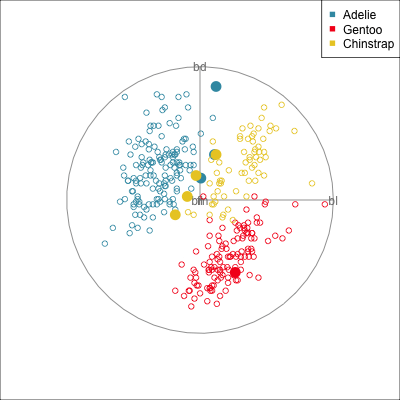
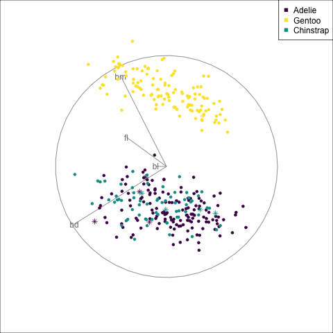
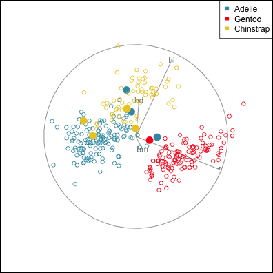
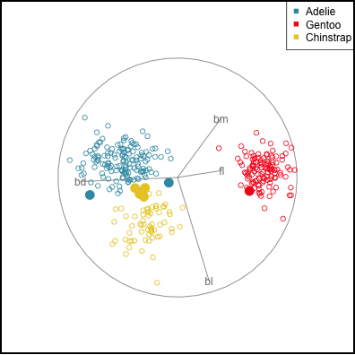
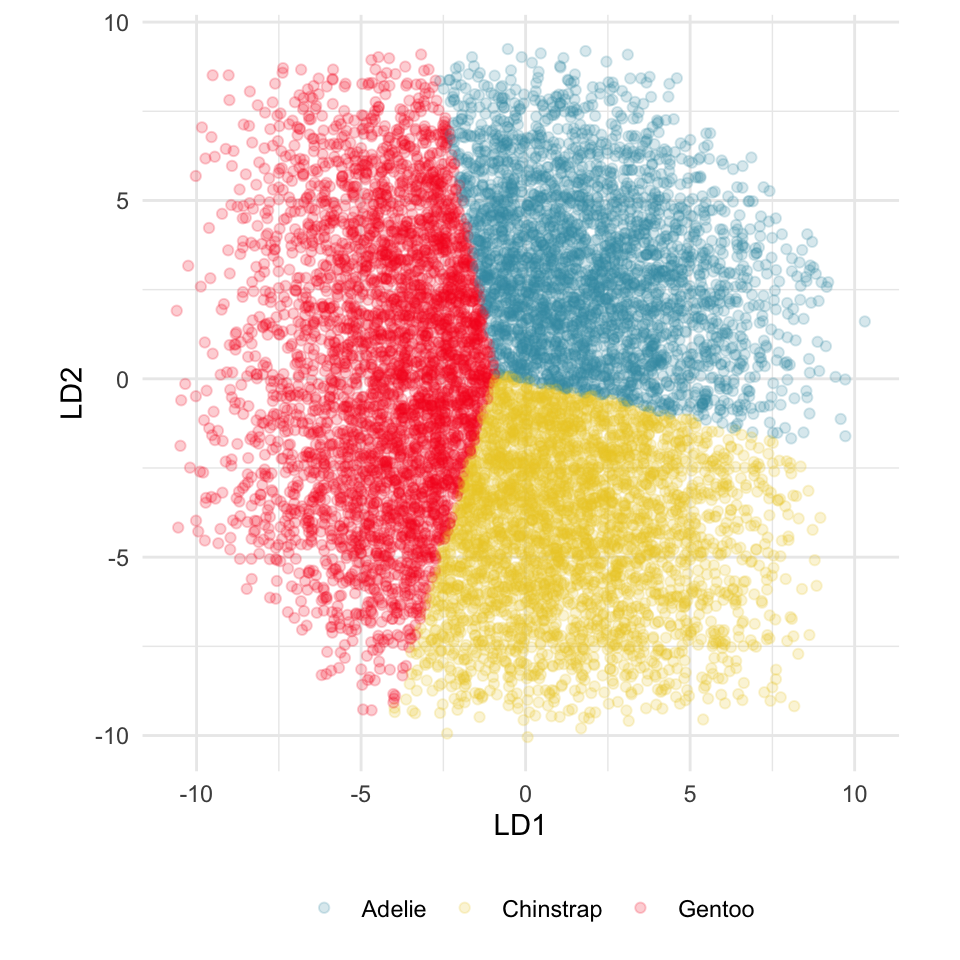
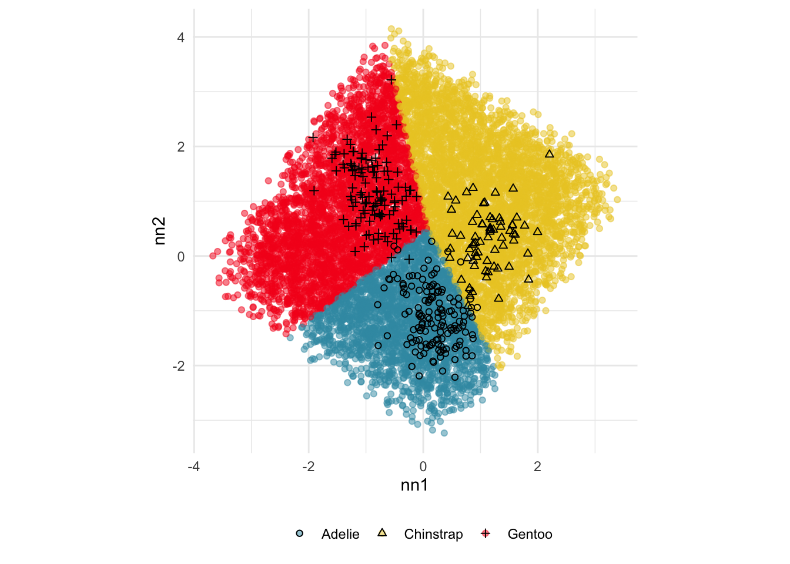
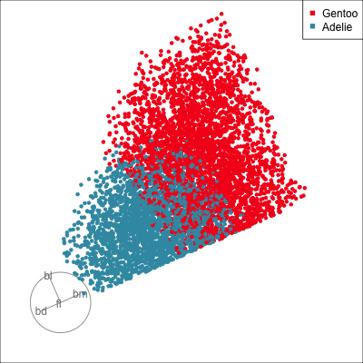
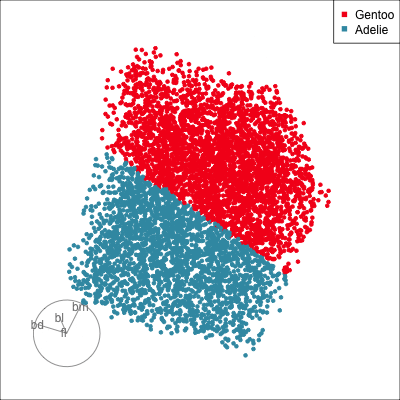

# Diagnostics for classification models {#sec-class-diag}
\index{classification!misclassification}

## Errors for a single model {#sec-class-errorr}

To examine misclassifications, we can create a separate variable that identifies the errors or not. Constructing this for each class, and exploring in small steps is helpful. Let's do this using the random forest model for the penguins fit. The random forest fit has only a few misclassifications. There are four Adelie penguins confused with Chinstrap, and similarly four Chinstrap confused with Adelie. There is one Gentoo penguin confused with a Chinstrap. This is interesting, because the Gentoo cluster is well separated from the clusters of the other two penguin species. 

```{r echo=knitr::is_html_output()}
#| message: false
#| code-summary: "Code to fit forest"
library(randomForest)
library(dplyr)
load("data/penguins_sub.rda")

penguins_rf <- randomForest(species~.,
                             data=penguins_sub[,1:5],
                             importance=TRUE)
```
\index{classification!confusion matrix}

```{r}
#| code-fold: false
penguins_rf$confusion
penguins_errors <- penguins_sub |>
  mutate(err = ifelse(penguins_rf$predicted !=
                        penguins_rf$y, 1, 0))
```

```{r echo=knitr::is_html_output()}
#| eval: false
#| code-summary: "Code to make animated gifs"
library(tourr)
symbols <- c(1, 16)
p_pch <- symbols[penguins_errors$err+1]
p_cex <- rep(1, length(p_pch))
p_cex[penguins_errors$err==1] <- 2
animate_xy(penguins_errors[,1:4],
           col=penguins_errors$species,
           pch=p_pch, cex=p_cex)
render_gif(penguins_errors[,1:4],
           grand_tour(),
           display_xy(col=penguins_errors$species,
                      pch=p_pch, cex=p_cex),
           gif_file="gifs/p_rf_errors.gif",
           frames=500,
           width=400,
           height=400)

animate_xy(penguins_errors[,1:4],
           guided_tour(lda_pp(penguins_errors$species)),
           col=penguins_errors$species,
           pch=pch)

render_gif(penguins_errors[,1:4],
           guided_tour(lda_pp(penguins_errors$species)),
           display_xy(col=penguins_errors$species,
                      pch=p_pch, cex=p_cex),
           gif_file="gifs/p_rf_errors_guided.gif",
           frames=500,
           width=400,
           height=400,
           loop=FALSE)

```

`r ifelse(knitr::is_html_output(), '@fig-p-errors-html', '@fig-p-errors-pdf')` shows a grand tour, and a guided tour, of the penguins data, where the misclassifications are marked by an asterisk. (If the gifs are too small to see the different glyphs, you can zoom in to make the figures larger.) It can be seen that the one Gentoo penguin that is mistaken for a Chinstrap by the forest model is always moving with its other Gentoo (yellow) family. It can occasionally be seen to be on the edge of the group, closer to the Chinstraps, in some projections in the grand tour. But in the final projection from the guided tour it is hiding well among the other Gentoos. This is an observation where a mistake has been made because of the inadequacies of the forest algorithm. Forests are only as good as the trees they are constructed from, and we have seen from @sec-trees that the splits only on single variables done by trees does not adequately utilise the covariance structure in each class. They make mistakes based on the boxy nature of the boundaries. This can carry through to the forests model. Even though many trees are combined to generate smoother boundaries, forests do not effectively utilise covariance in clusters either. The other mistakes, where Chinstrap are predicted to be Adelie, and vice versa, are more sensible. These mistaken observations can be seen to lie in the border region between the two clusters, and reflect genuine uncertainty about the classification of penguins in these two species.

::: {.content-visible when-format="html"}
::: {#fig-p-errors-html layout-ncol=2}

{#fig-rf-errors fig-alt="FIX ME" width=300}

{#fig-rf-errors-guided fig-alt="FIX ME" width=300}

Examining the misclassified cases (marked as solid circles) from a random forest fit to the penguins data. The one Gentoo penguin mistaken for a Chinstrap is a mistake made because the forest method suffers from the same problems as trees - cutting on single variables rather than effectively using covariance structure. The mistakes between the Adelie and Chinstrap penguins are more sensible because all of these observations lie is the bordering regions between the two clusters.
:::
:::

::: {.content-visible when-format="pdf"}
::: {#fig-p-errors-pdf layout-ncol=2}

{#fig-rf-errors fig-alt="FIX ME" width=200}

{#fig-rf-errors-guided fig-alt="FIX ME" width=200}

Examining the misclassified cases (marked as asterisks) from a random forest fit to the penguins data. The one Gentoo penguin mistaken for a Chinstrap is a mistake made because the forest method suffers from the same problems as trees - cutting on single variables rather than effectively using covariance structure. The mistakes between the Adelie and Chinstrap penguins are more sensible because all of these observations lie is the bordering regions between the two clusters.
:::
:::

::: {.content-visible when-format="html"}
::: info
Some errors are reasonable because there is overlap between the class clusters. Some errors are not reasonable because the model used is inadequate.
:::
:::

::: {.content-visible when-format="pdf"}
\infobox{Some errors are reasonable because there is overlap between the class clusters. Some errors are not reasonable because the model used is inadequate.
}
:::


## Examining boundaries {#sec-class-bnd}

<!-- Check against LDA, suspect that `bm` is used too much in CNN model.-->

@fig-penguins-lda-nn shows the boundaries for this NN model along with those of the LDA model.

```{r echo=knitr::is_html_output(), eval=FALSE}
#| label: fig-penguins-nn-boundaries
#| code-fold: true
# Generate grid over explanatory variables
p_grid <- tibble(
  bl = runif(10000, min(penguins_sub$bl), max(penguins_sub$bl)),
  bd = runif(10000, min(penguins_sub$bd), max(penguins_sub$bd)),
  fl = runif(10000, min(penguins_sub$fl), max(penguins_sub$fl)),
  bm = runif(10000, min(penguins_sub$bm), max(penguins_sub$bm))
)
# Predict grid
p_grid_pred <- p_nn_model |>
  predict(as.matrix(p_grid), verbose=0)
p_grid_pred_cat <- levels(p_train$species)[apply(p_grid_pred, 1, which.max)]
p_grid_pred_cat <- factor(p_grid_pred_cat,
                          levels=levels(p_train$species))

# Project into weights from the two nodes
p_grid_proj <- as.matrix(p_grid) %*% p_nn_wgts_on
colnames(p_grid_proj) <- c("nn1", "nn2")
p_grid_proj <- p_grid_proj |> 
  as_tibble() |>
  mutate(species = p_grid_pred_cat)

# Plot
ggplot(p_grid_proj, aes(x=nn1, y=nn2, 
                     colour=species)) + 
  geom_point(alpha=0.5) +
  geom_point(data=p_all_m, aes(x=nn1, 
                               y=nn2, 
                               shape=species),
             inherit.aes = FALSE) +
  scale_colour_discrete_divergingx(palette="Zissou 1") +
  scale_shape_manual(values=c(1, 2, 3)) +
  theme_minimal() +
  theme(aspect.ratio=1, 
        legend.position = "bottom",
        legend.title = element_blank())
```

::: {.content-visible when-format="html"}
::: {#fig-penguins-lda-nn-html layout-ncol="2"}
{#fig-lda-boundary fig-alt="FIX ME" width="300"}

{#fig-tree-boundary fig-alt="FIX ME" width="300"}

Comparison of the boundaries produced by the LDA (a) and the NN (b) model, using a slice tour.
:::
:::

::: {#fig-penguins-lda-nn layout-ncol="2"}
{#fig-lda-boundary2 fig-alt="FIX ME" width="200"}

{#fig-nn-boundary fig-alt="FIX ME" width="290"}

Comparison of the boundaries produced by the LDA (a) and the NN (b) model, using a slice tour.
:::

\index{tour!slice}

## Explainability {#sec-class-explain}

\index{variable importance}

The purpose of interpreting a model is to develop an understanding of how the predictors are related to class differences. If the model fits well, then how the model sees the relationship will reliably describe the relationship. Ideally, one can make statements like "class A differs from class B most when this combination of $x_1$, ..., $x_p$ is used", or more simply "$x_1$ and $x_5$ are the most important variables for distinguishing class A from B". 

When statistical models are used, such as LDA (or logistic regression) boundaries between classes are linear, and the importance of variables are typically read from the estimated coefficients. They can be considered to be *global*, because the relationship is the same throughout the data domain. The variable importance provided by random forests is also global importance, but they do not describe smaller intricacies in the (likely nonlinear) boundaries induced by the fitted model. 

If the predictors have associations, then interpreting measures of importance can be confounded by the associations. A variable may earn a low importance score but actually have a strong contribution to a class separation because it is associated with another predictor that has a high importance score. This can be detangled by examining relationships between predictor and response, conditional on other predictors. Statistical models, though, tend to have a singular focus, and even though two associated variables may have similar importance they will primarily build from only one of them. Ensemble models such as random forest have an advantage here because of the sub-sampling of variables built in to the ensemble architecture. Some elements of the ensemble will only have one of the two variables, so both variables should emerge in the diagnostics as having high importance scores. 

But forests build from trees which make greedy linear splits on single variables. If there are multiple ways to separate class clusters, trees and forests will grab one to use. So similarly the fitted model has tunnel vision for one solution. 

This is what explainability is attempting to assist with, what is it that the fitted model sees. What we see when we make plots of the data might differ from the model sees, which can be confusing. The role of explainability is to pull the fitted model apart to inspect how it has been built for the purposes of understanding how it will make predictions and how it considers the relationship between response and predictors. 

As suggested by the ruminations above, it can be messy work, requiring persistence and effort to develop a good understanding of any fitted model. Local explanation measures are designed to help, but there are a variety of different calculation techniques which may produce conflicting interpretations. In addition, local explanations are observation-level values, because they provide information that is only reliable for a local neighbourhood of a single observation.

A good interpretability workflow includes:

- Displays of the fitted model, such as that generated by simulating and predicting data in the full domain. 
- Plots of the training data, because the model fit depends on this set of data, and thus is only interpretable based on this set. Although explanations will be used with new data (like the test set) to explain how they are predicted, because they are not used to build the model it could be confusing for understanding the model fit. 
- Global variable importances, and local explanations calculated in different ways. 

A good resource for learning about the range of local explainability methods is @iml. Here we describe how to use tours in association with explanation metrics. Primarily for interpretability, we need to make plots of single (or pairs of) variables because we need to make explanations in terms of single variables. Tours are used to examine boundaries close to a point, if we are to understand local non-linear boundaries, so a slice tour on a small neighbourhood is needed. Also, when multiple variables are working together to generate a prediction, the radial tour to examine the influence of single variables on the projection can be useful.

<!--
- global importance
- partial dependence profiles
- local explainers, explanation
- usage: and handling disagreements-->


<!-- ### Local explanations: SHAP-->

\index{classification!local explanations} \index{classification!XAI}

<!-- It especially important to be able to interpret or explain a model, even more so when the model is complex or black-box'y. A good resource for learning about the range of methods is @iml. Local explanations provide some information about variables that are important for making the prediction for a particular observation.
-->

For illustration, we choose local explanations produced by Shapley values. These are computed using the `kernelshap` function in the `kernelshap` package [@kernelshap], and re-organised using the `shapviz` function in the `shapviz` package [@shapviz]. A Shapley value for an observation indicates how the variable contributes to the model prediction for that observation, relative to other variables. It is an average, computed from the change in prediction when all combinations of presence or absence of other variables. In the computation, for each combination, the prediction is computed by substituting absent variables with their average value, like one might do when imputing missing values. A (larger) positive SHAP value indicates that the variable increases the likelihood of prediction to that class, and conversely a (larger) negative value indicates decreased likelihood of prediction to that class.

```{r echo=knitr::is_html_output()}
#| message: false
# Split the data intro training and testing, as done in 17-nn chapter
library(dplyr)
library(tidyr)
library(rsample)
library(tidymodels)
library(keras)

load("data/penguins_sub.rda") # from mulgar book

set.seed(821)
p_split <- penguins_sub |> 
  select(bl:species) |>
  initial_split(prop = 2/3, 
                strata=species)
p_train <- training(p_split)
p_test <- testing(p_split)

# Data needs to be matrix, and response needs to be numeric
p_train_x <- p_train |>
  select(bl:bm) |>
  as.matrix()
p_train_y <- p_train |> pull(species) |> as.numeric() 
p_train_y <- p_train_y-1 # Needs to be 0, 1, 2
p_test_x <- p_test |>
  select(bl:bm) |>
  as.matrix()
p_test_y <- p_test |> pull(species) |> as.numeric() 
p_test_y <- p_test_y-1 # Needs to be 0, 1, 2

# Predict training and test set
p_nn_model <- load_model_tf("data/penguins_cnn")
p_train_pred <- p_nn_model |> 
  predict(p_train_x, verbose = 0)
p_train_pred_cat <- levels(p_train$species)[
  apply(p_train_pred, 1,
        which.max)]
p_train_pred_cat <- factor(
  p_train_pred_cat,
  levels=levels(p_train$species))

p_test_pred <- p_nn_model |> 
  predict(p_test_x, verbose = 0)
p_test_pred_cat <- levels(p_test$species)[
  apply(p_test_pred, 1, 
        which.max)]
p_test_pred_cat <- factor(
  p_test_pred_cat,
  levels=levels(p_test$species))
```

\index{software!kernelshap}
\index{software!shapviz}

```{r eval=FALSE}
# Explanations
# https://www.r-bloggers.com/2022/08/kernel-shap/
library(kernelshap)
library(shapviz)
p_explain <- kernelshap(
    p_nn_model,
    p_train_x, 
    bg_X = p_train_x,
    verbose = FALSE
  )
p_exp_sv <- shapviz(p_explain)
save(p_exp_sv, file="data/p_exp_sv.rda")
```

```{r echo=knitr::is_html_output()}
#| code-fold: true
load("data/p_exp_sv.rda")
p_exp_gentoo <- p_exp_sv$Class_3$S
p_exp_gentoo <- p_exp_gentoo |>
  as_tibble() |>
  mutate(species = p_train$species,
         pspecies = p_train_pred_cat,
  ) |>
  mutate(error = ifelse(species == pspecies, 0, 1)) |>
  mutate(error = factor(error, labels=c("no", "yes")))
```


```{r echo=knitr::is_html_output()}
#| label: tbl-p-shap
#| warning: false
#| tbl-cap: "SHAP values for the Gentoo penguin misclassified as Adelie. "
p_row_id <- c(1:nrow(p_exp_gentoo))[p_exp_gentoo$species == "Gentoo" &
                                      p_exp_gentoo$pspecies == "Adelie"]
p_outlier <- rbind(as.numeric(p_exp_sv$Class_1$S[p_row_id,]),
                     as.numeric(p_exp_sv$Class_2$S[p_row_id,]),
                     as.numeric(p_exp_sv$Class_3$S[p_row_id,])) |>
  as_tibble() |>
  rename(bl=V1, bd=V2, fl=V3, bm=V4) |>
  mutate(species = c("Adelie", "Chinstrap", "Gentoo")) |>
  select(species, bl:bm)
knitr::kable(p_outlier, digits=2)
```

@fig-shap shows the Shapley values for all the Gentoo observations in the *training* set of penguins data, as a parallel coordinate plot (a) and a scatterplot matrix (b). It can be useful to compare the SHAP values for all the observations in a class, to understand differences in their predictions. A parallel coordinate plot is better than a scatterplot matrix here because it focuses on single variables, and the differences in SHAP values across the variables. The values for the single misclassified Gentoo penguin (in the training set) is coloured orange-brown. The SHAP values for this penguin are similar to other penguins on `bl`, `bd` and `fl` but they are very different on `bm`. 

@tbl-p-shap contains the SHAP values for this penguin, for all three classes, and all four variables. The explanations for this misclassified penguin are then:

- For a high likelihood of a correct Gentoo prediction (third line) for this penguin, one should consider `bd`, and possibly `bl` but not the `bm` value.
- A mistaken classification as Adelie (first line) would happen with higher likelihood if the `bm` value is considered.
- A mistaken classification as Chinstrap (second line) has a smaller likelihood if `bl` is considered.

<!-- For the misclassified penguin, the effect of `bm` for all combinations of other variables leads to a decline in predicted value, thus less confidence in it being a Gentoo. In contrast, for this same penguin when considering the effect of `bl` the predicted value increases on average.-->

\index{parallel coordinate plot (PCP)}

```{r echo=knitr::is_html_output()}
#| eval: false
#| code-fold: true
#| label: fig-shapley-dot
#| fig-width: 4
#| fig-height: 3
#| out-width: 80%
#| fig-cap: "SHAP values focused on Gentoo class, for each variable. The one misclassified penguin (orange) has a much lower value for body mass, suggesting that this variable is used differently for the prediction than for other penguins." 
#| fig-alt: FIXME
library(colorspace)
p_exp_gentoo |>
  filter(species == "Gentoo") |>
  pivot_longer(bl:bm, names_to="var", values_to="shap") |>
  mutate(var = factor(var, levels=c("bl", "bd", "fl", "bm"))) |>
  ggplot(aes(x=var, y=shap, colour=factor(error))) +
  geom_quasirandom(alpha=0.8) +
  scale_colour_discrete_divergingx(palette="Geyser") +
  #facet_wrap(~var) +
  xlab("") + ylab("SHAP") +
  theme_minimal() + 
  theme(legend.position = "none")
```

```{r echo=knitr::is_html_output()}
#| code-fold: true
#| message: false
#| warning: false
library(colorspace)
library(ggpcp)
library(GGally)
p_pcp <- p_exp_gentoo |>
  filter(species == "Gentoo") |>
  pcp_select(1:4) |>
  ggplot(aes_pcp()) +
    geom_pcp_axes() + 
    geom_pcp_boxes(fill="grey80") + 
    geom_pcp(aes(colour = factor(error)), 
             linewidth = 1.5, alpha=0.3) +
  scale_colour_discrete_divergingx(palette="Geyser") +
  xlab("") + ylab("SHAP") +
  theme_minimal() +
  theme(legend.position = "none")
d <- p_exp_gentoo |>
  filter(species == "Gentoo") 
p_sm <- ggpairs(d, columns = 1:4, 
        upper = list(continuous = wrap("points", alpha = 0.8)), 
        lower = list(continuous = wrap("points", alpha = 0.8)), 
        diag = list(continuous = wrap("barDiag", alpha = 0.8, bins = 15)), 
        ggplot2::aes(colour = error, fill = error), 
        alpha = 0.5) +
    scale_colour_discrete_divergingx(palette="Geyser") +
    scale_fill_discrete_divergingx(palette="Geyser") +
    theme(aspect.ratio = 1,
          panel.background=element_rect(fill=NA, colour="black"),
          axis.text = element_blank(),
          axis.ticks = element_blank())
```

::: {#fig-shap  layout="[[50, 50]]"}

```{r}
#| label: fig-shapley-pcp
#| echo: false
#| fig-width: 4
#| fig-height: 4
#| out-width: 90%
#| fig-cap: "Parallel coordinates" 
#| fig-alt: FIXME
p_pcp
```


```{r}
#| label: fig-shapley-sm
#| echo: false
#| fig-width: 5
#| fig-height: 5
#| out-width: 90%
#| fig-cap: "Scatterplot matrix" 
#| fig-alt: FIXME
p_sm
```

SHAP values for the training set of Gentoo penguins, shown as a parallel coordinate plot (a) and a scatterplot matrix (b).  Colour indicates whether the model made a mistake in the prediction. The one misclassified penguin (orange brown) differs from other penguins primarily in its body mass value, which says that SHAP sees body mass as playing a role in the misclassification.
:::

If we examine the data [@fig-penguins-bl-bm-bd] the explanations make some sense. The misclassified penguin has an unusually small value on `bm`. That the SHAP value for `bm` was quite different from those of the other Gentoo penguins pointed to this being the potential issue with the model, particularly for this penguin. This penguin's prediction is negatively impacted by `bm` being in the model.

```{r echo=knitr::is_html_output()}
#| label: fig-penguins-bl-bm-bd
#| code-fold: true
#| fig-width: 8
#| fig-height: 6
#| out-width: 100%
#| fig-cap: "Plots of the training data with misclassified observations marked to help understand what the SHAP values. The misclassified Gentoo penguin has an unusually low body mass value which makes it appear to be more like an Adelie penguin, particularly when considered in relation to it's bill length." 
#| fig-alt: FIXME
library(patchwork)
# Check position on bm
shap_proj <- p_exp_gentoo |>
  filter(species == "Gentoo", error == "yes") |>
  select(bl:bm)
shap_proj <- tourr::normalise(shap_proj) #as.matrix(shap_proj/sqrt(sum(shap_proj^2)))
p_exp_gentoo_proj <- p_exp_gentoo |>
  rename(shap_bl = bl, 
         shap_bd = bd,
         shap_fl = fl, 
         shap_bm = bm) |>
  bind_cols(as_tibble(p_train_x)) |>
  mutate(shap1 = shap_proj[1]*bl+
           shap_proj[2]*bd+
           shap_proj[3]*fl+
           shap_proj[4]*bm)
sp1 <- ggplot(p_exp_gentoo_proj, aes(x=bm, y=bl, 
             colour=species, 
             shape=factor(error))) + #factor(1-error))) +
    geom_point(alpha=0.8) +
  scale_colour_discrete_divergingx(palette="Zissou 1") +
  scale_shape_manual("error", values=c(1, 19)) +
  theme_minimal() + 
  theme(aspect.ratio=1, 
        legend.position="bottom", 
        legend.direction="horizontal")
sp2 <- ggplot(p_exp_gentoo_proj, aes(x=bm, y=shap1, 
             colour=species, 
             shape=factor(error))) + #factor(1-error))) +
    geom_point(alpha=0.8) +
  scale_colour_discrete_divergingx(palette="Zissou 1") +
  scale_shape_manual("error", values=c(19, 1)) +
  ylab("SHAP") +
  theme_minimal() + 
  theme(aspect.ratio=1, 
        legend.position="bottom",
        legend.direction = "horizontal",
        axis.text = element_blank())
sp2 <- ggplot(p_exp_gentoo_proj, aes(x=shap1, 
             fill=species, colour=species)) +
  geom_density(alpha=0.5) +
  geom_vline(xintercept = p_exp_gentoo_proj$shap1[
    p_exp_gentoo_proj$species=="Gentoo" &
    p_exp_gentoo_proj$error==1], colour="black") +
  scale_fill_discrete_divergingx(palette="Zissou 1") +
  scale_colour_discrete_divergingx(palette="Zissou 1") +
  theme_minimal() + 
  theme(aspect.ratio=1, legend.position="bottom")
sp2 <- ggplot(p_exp_gentoo_proj, aes(x=bm, y=bd, 
             colour=species, 
             shape=factor(error))) + #factor(1-error))) +
    geom_point(alpha=0.8) +
  scale_colour_discrete_divergingx(palette="Zissou 1") +
  scale_shape_manual("error", values=c(1, 19)) +
  theme_minimal() + 
  theme(aspect.ratio=1, 
        legend.position="bottom",
        legend.direction = "horizontal",
        axis.text = element_blank())
sp3 <- ggplot(p_exp_gentoo_proj, aes(x=bm, y=fl, 
             colour=species, 
             shape=factor(error))) + #factor(1-error))) +
    geom_point(alpha=0.8) +
  scale_colour_discrete_divergingx(palette="Zissou 1") +
  scale_shape_manual("error", values=c(1, 19)) +
  theme_minimal() + 
  theme(aspect.ratio=1, 
        legend.position="bottom",
        legend.direction = "horizontal",
        axis.text = element_blank())
sp1 + sp2 + sp3 + plot_layout(ncol=3, guides = "collect") &
  theme(legend.position="bottom",
        legend.direction = "horizontal")
```

This is a good point to examine the boundary between Gentoo and Adelie penguins. Focusing on just two classes is easier, and it is between these two classes that the error in classification occurs. Examining the boundary can be achieved by simulating a large number of points in the data domain and predicting the class of these points. @fig-penguins-bndry shows these predictions, along with the observed training values. The scatterplots show the same pairs of variables as shown in @fig-penguins-bl-bm-bd. Pixel points indicate the simulated data covering the data domain, and allowing the boundary to be examined. The observed training data is overlaid, with solid circles indicating an error. It's a bit messy but the most important part to see is that the boundary between classes is mostly in the vertical direction, which corresponds to cutting primarily on `bm`. It's not completely `bm` because there is some overlap of the red and blue points here, and the direction is not quite vertical. Particularly, with `bd` there the direction of the boundary is slightly oblique. (Note that the white area in the top left of `bl` vs `bm` actually corresponds to the Chinstrap prediction region, which we have removed to focus on Adelie and Gentoo.)

```{r echo=knitr::is_html_output()}
#| label: fig-penguins-bndry
#| code-fold: true
#| fig-width: 8
#| fig-height: 6
#| out-width: 100%
#| fig-cap: "Pairwise plots of classification boundaries (pixel points) to examine where the misclassification happens. The observed training data is overlaid with solid circle indicating a classification error. The boundary of this model falls almost entirely in body mass, with small contribution of the other variables, as seen by the difference between the two classes being mostly visible in the vertical direction." 
#| fig-alt: FIXME
n <- 10000
p_sim <- tibble(bl = runif(n, min(penguins_sub$bl), max(penguins_sub$bl)),
                bd = runif(n, min(penguins_sub$bd), max(penguins_sub$bd)),
                fl = runif(n, min(penguins_sub$fl), max(penguins_sub$fl)),
                bm = runif(n, min(penguins_sub$bm), max(penguins_sub$bm))) |>
  as.matrix()
p_sim_pred <- p_nn_model |> 
  predict(p_sim, verbose = 0)
colnames(p_sim_pred) <- c("Adelie", "Chinstrap", "Gentoo")
p_sim_class <- apply(p_sim_pred, 1, which.max)
p_sim_class <- c("Adelie", "Chinstrap", "Gentoo")[p_sim_class]
p_sim_pred <- p_sim_pred |>
  as_tibble() |>
  mutate(species = factor(p_sim_class))
p_sim <- p_sim |>
  as_tibble() |>
  mutate(species = factor(p_sim_class))
# animate_slice(p_sim[,1:4], col=p_sim$species, v_rel=0.6, axes="bottomleft")

p_sim_a_g <- p_sim |>
  filter(species != "Chinstrap")
bd1 <- p_sim_a_g |>
  ggplot() + 
    geom_point(aes(x=bm, y=bl, colour=species), shape=20, size=0.01) +
    geom_point(data=filter(p_exp_gentoo_proj, species != "Chinstrap"),
               aes(x=bm, y=bl, 
               colour=species, 
               shape=factor(error)), alpha=0.8) +
  scale_colour_discrete_divergingx(palette="Zissou 1") +
  scale_shape_manual("error", values=c(1, 19)) +
  theme_minimal() + 
  theme(aspect.ratio=1, 
        legend.position="bottom", 
        legend.direction="horizontal",
        axis.text = element_blank())

bd2 <- p_sim_a_g |>
  ggplot() + 
    geom_point(aes(x=bm, y=bd, colour=species), shape=20, size=0.01) +
    geom_point(data=filter(p_exp_gentoo_proj, species != "Chinstrap"),
               aes(x=bm, y=bd, 
               colour=species, 
               shape=factor(error)), alpha=0.8) +
  scale_colour_discrete_divergingx(palette="Zissou 1") +
  scale_shape_manual("error", values=c(1, 19)) +
  theme_minimal() + 
  theme(aspect.ratio=1, 
        legend.position="bottom", 
        legend.direction="horizontal",
        axis.text = element_blank())

bd3 <- p_sim_a_g |>
  filter(species != "Chinstrap") |>
  ggplot() + 
    geom_point(aes(x=bm, y=fl, colour=species), shape=20, size=0.01) +
    geom_point(data=filter(p_exp_gentoo_proj, species != "Chinstrap"),
               aes(x=bm, y=fl, 
               colour=species, 
               shape=factor(error)), alpha=0.8) +
  scale_colour_discrete_divergingx(palette="Zissou 1") +
  scale_shape_manual("error", values=c(1, 19)) +
  theme_minimal() + 
  theme(aspect.ratio=1, 
        legend.position="bottom", 
        legend.direction="horizontal",
        axis.text = element_blank())

bd1 + bd2 + bd3 + plot_layout(ncol=3, guides = "collect") &
  theme(legend.position="bottom",
        legend.direction = "horizontal")

```

The next step is to use a radial tour to very directly find the boundary bteween Adelie and Gentoo. It is probably reasonable to start from a projection that is constructed using the SHAP values, with the idea that this combination of variables might also reveal where the prediction to either class occurs. Because we have seen that `bm` plays the most important role in the classification, creating a 2D projection basis where `bm` is contrasted against a combination of the other variables, is our strategy for initialising the radial tour. `r ifelse(knitr::is_html_output(), '@fig-bndry-html', '@fig-bndry-pdf')` shows the boundary being found using the radial tour.

```{r}
#| eval: false
#| echo: false
prj <- tourr::basis_random(4, 2)
prj[,1] <- as.numeric(shap_proj)
prj[,2] <- c(1,0,0,0)
prj <- tourr::orthonormalise(prj)
p_sim_a_g <- p_sim_a_g |>
  mutate(species = factor(species))
p_bndry_path <- save_history(p_sim_a_g[,1:4], radial_tour(prj, mvar=1),
                             max_bases = 12)
p_bndry_path_i <- interpolate(p_bndry_path, angle=0.01)
animate_xy(p_sim_a_g[,1:4], radial_tour(prj, mvar=1), 
           col=p_sim_a_g$species, axes="bottomleft")
animate_xy(p_sim_a_g[,1:4], planned_tour(p_bndry_path), 
           col=p_sim_a_g$species, axes="bottomleft")
render_gif(p_sim_a_g[,1:4], 
           radial_tour(prj, mvar=1), 
           display_xy(col=p_sim_a_g$species, 
                      axes="bottomleft"),
           gif_file = "gifs/p_nn_bndry.gif",
           frames = 1000,
           width = 400, 
           height = 400
)
render_gif(p_sim_a_g[,1:4], 
           planned_tour(p_bndry_path), 
           display_xy(col=p_sim_a_g$species, 
                      axes="bottomleft"),
           gif_file = "gifs/p_nn_bndry2.gif",
           frames = 1000,
           width = 400, 
           height = 400
)

```

::: {.content-visible when-format="pdf"}
::: {#fig-bndry-pdf  layout="[[50, 50]]"}





Projections taken from a radial tour used to investigate where the boundary falls: (a) initial projection formed using the SHAP values, (b) projection where the linear boundary is clearly visible. The boundary is almost entirely due to body mass, with small contributions from body depth, and a tiny contribution from bill length, as can be seen from the direction and magnitude of the axes.
:::
:::

::: {.content-visible when-format="html"}
::: {#fig-bndry--html layout="[[50, 50]]"}


Radial tour used to investigate where the boundary falls: (a) animated gif, (b) projection where the linear boundary is clearly visible. The boundary is almost entirely due to body mass, with small contributions from body depth, and a tiny contribution from bill length, as can be seen from the direction and magnitude of the axes.
:::
:::

So what have we learned. The SHAP values suggested numerous variables involved with the classification of the species. Using the tour shows that the separation between Adelie and Gentoo is mostly due to `bm`, for this fitted neural network model. The SHAP values over-stated the importance of the other variables. However, examining the SHAP values for all the training sample did help to uncover the reason why the one Gentoo penguin was misclassified as Adelie, its value of `bm` is unusual. 

By examining the class boundary, we also learn that this model is inadequate. It does not adequately use the relationship between `bm` and `bd` effectively as can be seen in @fig-penguins-bndry (middle plot). A cleaner distinction between Adelie and Gentoo would be achieved with a more oblique linear split. 

This example has been a relatively simple classification. The fitted model used linear splits to separate the classes, which was not very difficult to visualise. If the boundary between classes is much more non-linear then it might be necessary to zoom in close to the observation of interest, and to use a slice tour to examine the boundary close to the observation.

What we have seen is that the SHAP values provided some insight, but the message was not very clear even in this simple situation. It is helpful to use the tour to help to explain the explainers. 

In general, local explanations can mislead and be inaccurate explainers of the model fit. If a different method was used, such as LIME, counterfactuals, or anchors, the results can be conflicting explanations. After all, they are all estimates of what the model thinks. We need additional tools to evaluate which is more useful. 

It is also important to keep in mind that they are explaining a particular model fit. If the model is not a good fit, then the explainers are explaining a bad fit (aka rubbish), and you check the model fit statistics to make sure that the fit is one worth explaining. In most applications, predictors will have some association, which means there may be many similarly good fits, even though the end result of model fitting is to pick just one. 

## Exercises {-}

\index{data!fake trees}
\index{data!sketches}

1. Examine misclassifications from a random forest model for the fake trees data between cluster 1 and 0, using the 
    a. principal components
    b. votes matrix. 
Describe where these errors relative to their true and predicted class clusters. When examining the simplex, are the misclassifications the points that are furthest from any vertices?
2. Examine the misclassifications for the random forest model on the sketches data, focusing on cactus sketches that were mistaken for bananas. Follow up by plotting the images of these errors, and describe whether the classifier is correct that these sketches are so poor their true cactus or banana identity cannot be determined. 
3. How do the errors from the random forest model compare with those of your best fitting CNN model? Are the the corresponding images poor sketches of cacti or bananas?
4. Now examine the misclassifications of the sketches data in the 
    a. votes matrix from the random forest model
    b. predictive probability distribution from the CNN model,
using the simplex approach. Are they as expected, points lying in the middle or along an edge of the simplex?
5. Use the LDA model with explanations to assess boundary
