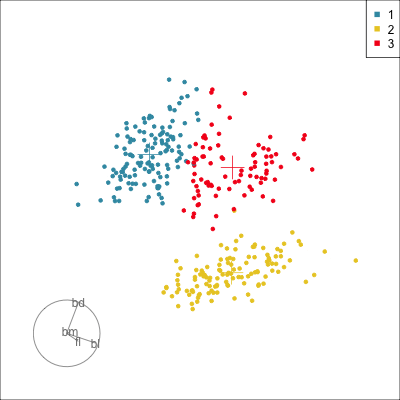
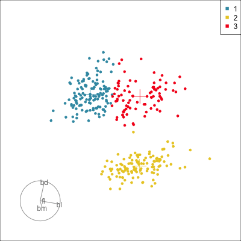
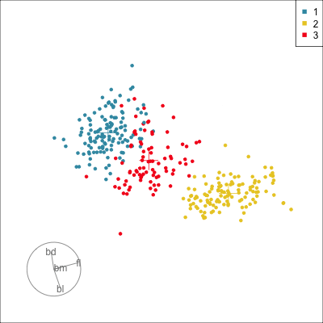
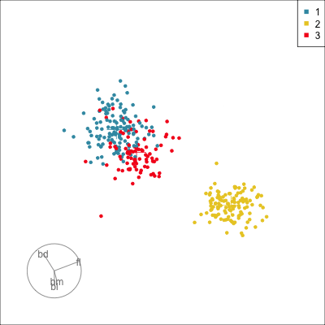

# $k$-means clustering {#sec-kmeans}
\index{cluster analysis!k-means}
\index{cluster analysis!algorithms}

One of the simplest and most efficient techniques for clustering data is the $k$-means algorithm. The algorithm begins with a choice for $k$, the number of clusters to divide the data into. It is seeded with $k$ initial means, and sequentially iterates through the observations, assigning them to the nearest mean, and re-calculating the $k$ means. It stops at a given number of iterations or when points no longer change clusters. The algorithm will tend to segment the data into roughly equal sized, or spherical clusters, and thus will work well if the clusters are separated and equally spherical in shape. It is possible to get different solutions depending on the random seed. Often, the choice is to run the algorithm multiple times and choose one solution. 

A good place to learn more about the $k$-means algorithm is Chapter 20 of @HOML. The algorithm has been in use for a long time! It was named $k$-means by @MacQueen1967, but developed by Lloyd in 1957 (as described in @Lloyd1982) and separately by @forgy65, and perhaps others as it is a very simple procedure.

Generally, there is no need to choose $k$ ahead of time. One would re-fit $k$-means with various choices of $k$, and compare the cluster validation  statistics such as those produced by the `cluster.stats()` function from the `fpc` package [@fpc]. We show here how to examine the clusters visually, which can be used in conjunction with the summary statistics, to decide on the optimal final value of $k$. 
\index{cluster analysis!cluster validation statistics}
\index{software!fpc}

::: {.content-visible when-format="html"}
::: info
The key elements to examine in a k-means clustering algorithm result  are:

- means 
- cluster labels

:::
:::

::: {.content-visible when-format="pdf"}
\infobox{The key elements to examine in a k-means clustering algorithm result  are:
\begin{itemize} \itemsep 0in
\item means 
\item cluster labels
\end{itemize}}
:::

## Examining results in 2D

@fig-km-2D shows the result of $k$-means clustering on two examples: (a) the 2D `simple_clusters` data and (b) two variables of the penguins data. We can see that it works well when the clusters are spherical, but for the penguins data it fails because the shape of the clusters is elliptical. It actually makes a mistake that would not be made if we simply visually clustered: cluster 3 has grouped points across a gap, a divide that visually we would all agree should form a separation.
\index{data!simple clusters}
\index{data!penguins}
\index{software!stats}

```{r}
#| code-fold: false
#| message: false
library(mulgar)
library(ggplot2)
library(dplyr)
library(colorspace)
library(patchwork)
data("simple_clusters")

set.seed(202305)
sc_km <- kmeans(simple_clusters[,1:2], centers=2, 
                     iter.max = 50, nstart = 5)
sc_km_means <- data.frame(sc_km$centers) |>
  mutate(cl = factor(rownames(sc_km$centers)))
sc_km_d <- simple_clusters[,1:2] |> 
  mutate(cl = factor(sc_km$cluster))
```

```{r echo=knitr::is_html_output()}
#| label: fig-km-2D
#| fig-cap: "Examining $k$-means clustering results for simple clusters (a, c) and two variables of the penguins data (b, d). Top row is input data and bottom row shows one solution for each, with $k=2$ and $3$ respectively. The means are indicated by a $+$. Points are coloured by cluster label. The results are perfect for the simple clusters but not for the penguins data. The penguin data is multimodal, with small gaps visible from the top right mode and the other two, and the shap of the bigger clusters is more elliptical. The $k$-means produces roughly three equal sized clusters, where cluster 3 groups observations over small gaps in the point clouds."
#| fig-alt: "Four panels of scatterplots labelled rowwise a-d. The top two are uncoloured, and the bottom two have coloured points. Each coloured group has one point displayed as a plus. Plot c has two circular separated clusters located at lower left and upper right, which are coloured red and blue. They correspond to labels 1 and 2 as shown by the legend at the bottom. Plot d has three coloured groups, blue, yellow, red labelled as 1, 2, 3, respectively. The red group occupies the top right quadrant of the square plot space, and some of the points are on both sides of a small gap where there are no points. The yellow group occupy the bottom right quadrant, and the blue group occupy the top left quadrant. The botton left is empty of points."
#| fig-width: 6
#| fig-height: 6
#| out-width: 100%
#| code-summary: "Code to make plots"
sc_km_p1 <- ggplot() +
  geom_point(data=sc_km_d, 
             aes(x=x1, y=x2), 
             alpha=0.4, size=1) +
  ggtitle("(a)") +
  theme_minimal() +
  theme(aspect.ratio = 1, 
        legend.position = "bottom",
        legend.title = element_blank()) 
sc_km_p2 <- ggplot() +
  geom_point(data=sc_km_d, 
             aes(x=x1, y=x2, colour=cl), 
             shape=16, alpha=0.4) +
  geom_point(data=sc_km_means, 
             aes(x=x1, y=x2, colour=cl), 
             shape=3, size=5) +
    scale_color_discrete_divergingx("Zissou 1") +
  ggtitle("(c)") +
  theme_minimal() +
  theme(aspect.ratio = 1, 
        legend.position = "bottom",
        legend.title = element_blank()) 

load("data/penguins_sub.rda")
p_bl_bd_km <- kmeans(penguins_sub[,c(1,2)], centers=3, 
                     iter.max = 50, nstart = 5)
p_bl_bd_km_means <- data.frame(p_bl_bd_km$centers) |>
  mutate(cl = factor(rownames(p_bl_bd_km$centers)))
p_bl_bd_km_d <- penguins_sub[,c(1,2)] |> 
  mutate(cl = factor(p_bl_bd_km$cluster))

p_bl_bd_km_p1 <- ggplot() +
  geom_point(data=p_bl_bd_km_d, 
             aes(x=bl, y=bd), 
             alpha=0.4, size=1) +
  ggtitle("(b)") +
  theme_minimal() +
  theme(aspect.ratio = 1, 
        legend.position = "bottom",
        legend.title = element_blank()) 
p_bl_bd_km_p2 <- ggplot() +
  geom_point(data=p_bl_bd_km_d, 
             aes(x=bl, y=bd, colour=cl), 
             shape=16, alpha=0.4) +
  geom_point(data=p_bl_bd_km_means, 
             aes(x=bl, y=bd, colour=cl), 
             shape=3, size=5) +
    scale_color_discrete_divergingx("Zissou 1") +
  ggtitle("(d)") +
  theme_minimal() +
  theme(aspect.ratio = 1, 
        legend.position = "bottom",
        legend.title = element_blank()) 

sc_km_p1 + p_bl_bd_km_p1  + sc_km_p2 + p_bl_bd_km_p2 + plot_layout(ncol=2)
```

::: {.content-visible when-format="html"}
::: insight
How our eyes perceive clusters is different from how $k$-means perceives clusters. We tend to tune into gaps or changes in density, but $k$-means tries to bound observations with circles (or spheres in more than two dimensions).
:::
:::

::: {.content-visible when-format="pdf"}
\insightbox{How our eyes perceive clusters is different from how $k$-means perceives clusters. We tend to tune into gaps or changes in density, but $k$-means tries to bound observations with circles (or spheres in more than two dimensions).}
:::


## Examining results in high dimensions

This approach extends to high-dimensions. One colours observations by the cluster label, and overlays the final cluster means. If we see gaps in points in a single cluster it would mean that $k$-means fails to see important cluster structure. This is what happens with the 4D penguins data as shown in `r ifelse(knitr::is_html_output(), '@fig-p-km-html', '@fig-p-km-pdf')`.

```{r}
#| code-fold: false
p_km <- kmeans(penguins_sub[,1:4], centers=3, 
                     iter.max = 50, nstart = 5)
p_km_means <- data.frame(p_km$centers) |>
  mutate(cl = factor(rownames(p_km$centers)))
p_km_d <- penguins_sub[,1:4] |> 
  mutate(cl = factor(p_km$cluster))
```

```{r echo=knitr::is_html_output()}
#| eval: false
#| code-summary: "Code to make animated gifs"
library(tourr)
p_km_means <- p_km_means |>
  mutate(type = "mean")
p_km_d <- p_km_d |>
  mutate(type = "data")
p_km_all <- bind_rows(p_km_means, p_km_d)
p_km_all$type <- factor(p_km_all$type, levels=c("mean", "data"))
p_pch <- c(3, 20)[as.numeric(p_km_all$type)]
p_cex <- c(3, 1)[as.numeric(p_km_all$type)]
animate_xy(p_km_all[,1:4], col=p_km_all$cl, 
           pch=p_pch, cex=p_cex, axes="bottomleft")
render_gif(p_km_all[,1:4],
           grand_tour(),
           display_xy(col=p_km_all$cl, 
                      pch=p_pch, 
                      cex=p_cex, 
                      axes="bottomleft"),
           gif_file="gifs/p_km.gif",
           width=400,
           height=400,
           frames=500)
```

::: {.content-visible when-format="html"}

{#fig-p-km-html fig-alt="Animation showing 2D projections from 4D. The points are coloured as blue, yellow and red labelled 1, 2, 3 respectively as indicated by the legend at top right. Most points are small dots expect for three shown as large plusses. The three groups are reasonably separated in many projections. The red group has points which cross a gap between visible clusters in the data." width=400}
:::

::: {.content-visible when-format="pdf"}
::: {#fig-p-km-pdf layout="[[50, 50]]"}

{fig-alt="A scatterplot showing one 2D projection of 4D data. Most points are small blue, red or yellow dots expect for three shown as large plusses. A legend at the top right labels the blue, yellow and red colours as 1, 2, or 3. The red group extends over a gap in clusters into the blue group. The red plus is almost in this gap where there are few points. The axis display at bottom left is a circle and segments, and shows bd pointing to 1 o'clock, and bl pointing to 4 o'clock. bm and fl contribute very little."}

{fig-alt="Another 2D projection very similar to the last. It shows the split between red and blue in an awkward spot but also one of the yellow group far from its own group and close to the red cluster. The axis display has a little difference between the fl and bm contributions than the previous projection."}

{ fig-alt="A different projection where the three groups line up from top left to bottom right. It mostly shows the outlier labelled as the red group. The axis display shows bd pointing to 12 o'clock, bl pointing to 5 o'clock, fl pointing to 2:30, and bm not contributing."}

{ fig-alt="A similar projection to the last one, except the groups are now very circular. The axis display shows bd pointing to 11 o'clock, bl and bm pointing to 6 o'clock, fl pointing to 2:30."}


Projections from using a tour to explore the $k$-means clustering result for the 4D penguins data. You can see cluster 2 clearly separated from the other observations. Cluster 3, like in the 2D example, is a mix of observations across a gap. Even the mean of the cluster is almost in the gap. 

:::
:::

::: {.content-visible when-format="html"}
::: info
Much like Wards linkage hierarchical clustering, $k$-means tends to group observations into clusters of similar size. For $k$-means it is like sliding spherical windows through the high dimensions to collect points into groups.
:::
:::

::: {.content-visible when-format="pdf"}
\infobox{Much like Wards linkage hierarchical clustering, $k$-means tends to group observations into clusters of similar size. For $k$-means it is like sliding spherical windows through the high dimensions to collect points into groups.
}
:::

\index{data!aflw}\index{data!fake trees}\index{data!penguins}

## Exercises {-}

1. Compute a $k$-means clustering for the `fake_trees` data, varying $k$ to about 20. Choose your best $k$, and examine the solution using the first 10 PCs on the data. It should capture the data quite nicely, although it will break up each branch into multiple clusters.
2. Compute a $k$-means clustering of the first four PCs of the `aflw` data. Examine the best solution (you choose which $k$), and describe how it divides the data. By examining the means, can you tell if it extracts clusters of offensive vs defensive vs midfield players? Or does it break the data into high skills vs low skills?
3. Use $k$-means clustering on the challenge data sets, `c1`-`c7` from the `mulgar` package. Explain what choice of $k$ is best for each data set, and why or why not the cluster structure, as you have described it from earlier chapters, is detected by $k$-means or not.
4. Use $k$means clustering on the data sets you generated in question 4 from @sec-intro-clust. How well does it capture the clusters that you have created.
5. Using $k$-means where $k=6$ for the four variables of the penguins data, to see if it captures the species AND sexes in the data. Make a tour of this data with the cluster means overlaid on the observations, and observations coloured by the cluster labels. Then tabulate the cluster labels against the species and sex values, to examine how well these are captured.

